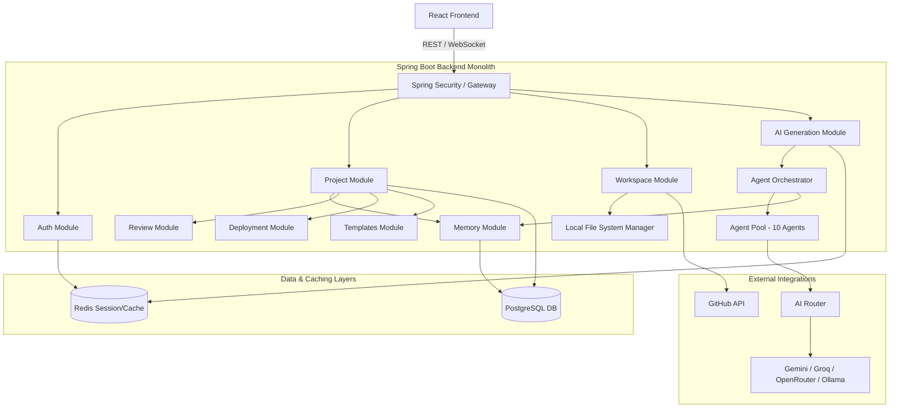
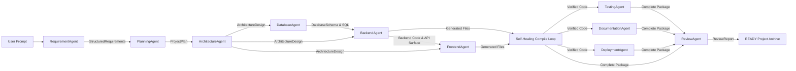

# ForgeMind — Component Dependency Graph

This document details the dependencies and interaction paths across all layers of the ForgeMind system, as established in the `09-48` documentation set.

---

## 1. High-Level System Dependency Graph



---

## 2. Backend Module Dependency Hierarchy

To maintain the modular monolith architecture and allow future service extraction, backend modules must strictly adhere to the following package-dependency rules (no circular dependencies allowed):

```
[API Gateway / Config]
   │
   ├──> [Auth Module] ───────────────> [Redis (Cache/Session)]
   │
   ├──> [Project Module] ────────────> [PostgreSQL (Entities/DTOs)]
   │       │
   │       ├──> [Memory Module]
   │       ├──> [Review Module]
   │       └──> [Templates Module]
   │
   ├──> [Workspace Module] ──────────> [Local File System]
   │       │
   │       └──> [Project Module] (Read-only project metadata)
   │
   └──> [AI Generation Module] ──────> [Memory Module]
           │
           └──> [Agent Orchestrator]
                   │
                   └──> [Agent Pool] ──> [AI Router] ──> [External AI Providers]
```

### Module Coupling Rules:
- Cross-module communication must happen via Java interfaces, never concrete implementations.
- No direct database joins across separate module domains (e.g., `workspace` table should not join with `review_reports` directly; request data via service interfaces).

---

## 3. Project Generation Pipeline Data Dependencies

Each generation stage relies directly on the output of the preceding stage. The pipeline cannot proceed if a critical dependency fails.


