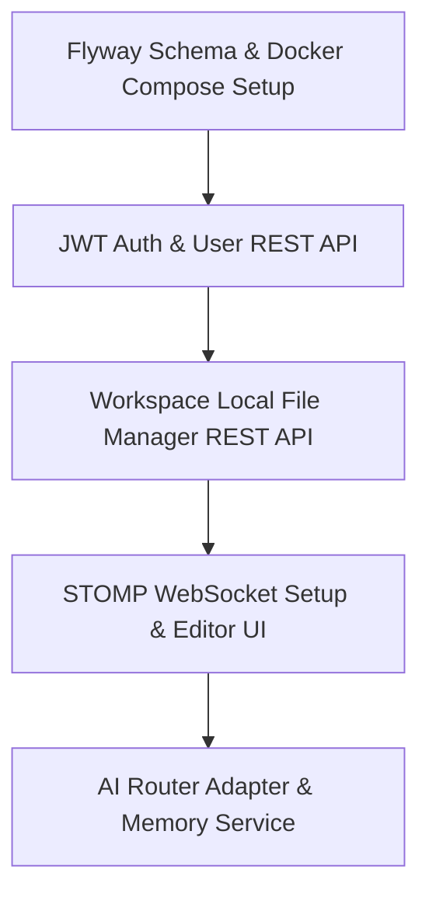

# ForgeMind — Implementation Readiness Report

This report evaluates the readiness of the ForgeMind codebase and architecture documentation prior to implementation. It evaluates consistency, structural validity, dependency flow, and identifies hidden blockers.

---

## 1. Overall Readiness Score: 85/100

The project has comprehensive technical design documents, database schemas, and folder structures. However, it cannot be scored 100/100 because of missing baseline documentation (`01-08`), and lack of security specs for executing untrusted AI code on the host machine.

---

## 2. Verification Checklist

| Area | Status | Findings |
|---|---|---|
| **1. Document Consistency** | ⚠️ Minor Issues | High consistency across the `09-48` extended docs. However, there is a minor contradiction between `26-agent-design.md` (unrecoverable pipeline failure) and `34-project-generation.md` (individual file failure recovery). |
| **2. Sprint Alignment** |  Passed | Sprints in `SPRINT_PLAN.md` start with foundation components and progress logically to complex agent execution, matching task priorities. |
| **3. Dependency Introduction** |  Passed | Dependencies (DB, Redis, WS, security filters) are introduced in phases, ensuring the foundation is built before integration starts. |
| **4. Backend Package Structure** |  Passed | `23-package-structure.md` follows Spring Boot conventions (`modules/{feature}`) and enforces dependency rules where `common` contains zero outgoing dependencies. |
| **5. Frontend Folder Structure** |  Passed | Organizes presentational elements (`components/ui`), page-specific layouts, state stores (`store/`), and api connectors (`api/`) cleanly. |
| **6. Database Normalization** |  Passed | Relational entities in `12-er-diagrams.md` use proper 3NF structure; flexible payloads (`tech_stack`, `files`) are delegated to PostgreSQL JSONB GIN indexes. |
| **7. API Versioning Strategy** |  Passed | Standard path versioning (`/api/v1`) with robust 90-day deprecation/sunset header policies. |
| **8. AI Provider Abstraction** |  Passed | Dynamic `AIProvider` interface with multi-vendor adapters (`Gemini`, `Groq`, `Ollama`) decouples LLM clients from the agent execution pool. |

---

## 3. Critical Blockers

1. **Security Sandbox for Code Compilation & Test Runs (Self-Healing Stage)**
   - **Details:** The system must compile Java/React code and execute generated test suites to verify code compilation during the self-healing phase. Executing this code directly on the host or inside standard containers poses severe Remote Code Execution (RCE) and local filesystem access risks.
   - **Resolution:** A sandboxing runtime architecture must be designed to execute code in ephemeral, network-isolated micro-VMs or secure sandboxed runtimes (e.g., gVisor, Firecracker).
2. **WebSocket Scaling with STOMP**
   - **Details:** While the tech stack documents Redis for WebSocket fan-out, horizontal scaling with standard Spring STOMP requires a full-fledged STOMP broker relay (e.g., RabbitMQ, ActiveMQ). Using a simple in-memory broker with Redis pub/sub bridges requires custom implementation.
   - **Resolution:** Explicitly integrate an external message broker (RabbitMQ) or define the custom Redis STOMP fan-out bridging adapter.
3. **Workspace File Edit Lock / Concurrency**
   - **Details:** The user and AI agents can simultaneously edit files in the workspace (Monaco Editor). Without conflict resolution or write locking, edits will overwrite each other.
   - **Resolution:** Design an optimistic file locking strategy using file content hashes or an Operational Transformation (OT) WebSocket engine.

---

## 4. Recommended Improvements & Missing Documents

### Recommended Missing Documents
- **`docs/forgemind-architecture/01-to-08-baseline/`**: Consolidate and reconstruct the missing `01-requirements.md` through `08-memory.md` documents.
- **`docs/forgemind-architecture/security/sandbox-specification.md`**: Detail sandboxing, execution limits, and filesystem protection layers.
- **`docs/forgemind-architecture/workspace/concurrency-specification.md`**: Define locking mechanics and file change subscription handlers.

### Key Architectural Improvements
- Integrate **Flyway** as the designated migration tool in the backend configuration.
- Implement **Optimistic locking headers** (`X-File-Hash-Version`) in the file read/write API endpoints to prevent race conditions.

---

## 5. Implementation Roadmap First-Steps

To prepare the platform for coding, developers should implement features in this order:

1. **Local Containers & Flyway (Sprint 1):** Spin up PostgreSQL/Redis and execute initial Flyway migration scripts.
2. **Stateless Security (Sprint 2):** Implement User/JWT authentication and secure resource filtering.
3. **Local Filesystem Access (Sprint 2):** Implement the local file adapter in the backend workspace module.
4. **WebSocket Sync (Sprint 3):** Implement the STOMP connection so the editor and terminal panels can stream events.

---

## 6. Ready to Begin Coding?

**Yes, with Conditions.**

Development can begin on **Phase 1 (Foundation)** and **Phase 2 (Core Platform)** immediately since local databases, authentication filters, and workspace CRUD logic are unaffected by the missing AI execution sandboxing specifications. However, coding on **Phase 5 (Self-Healing)** and **Phase 6 (Workspace Chat & Code Execution)** must be blocked until the Security Sandbox and STOMP message broker scaling plans are finalized.
