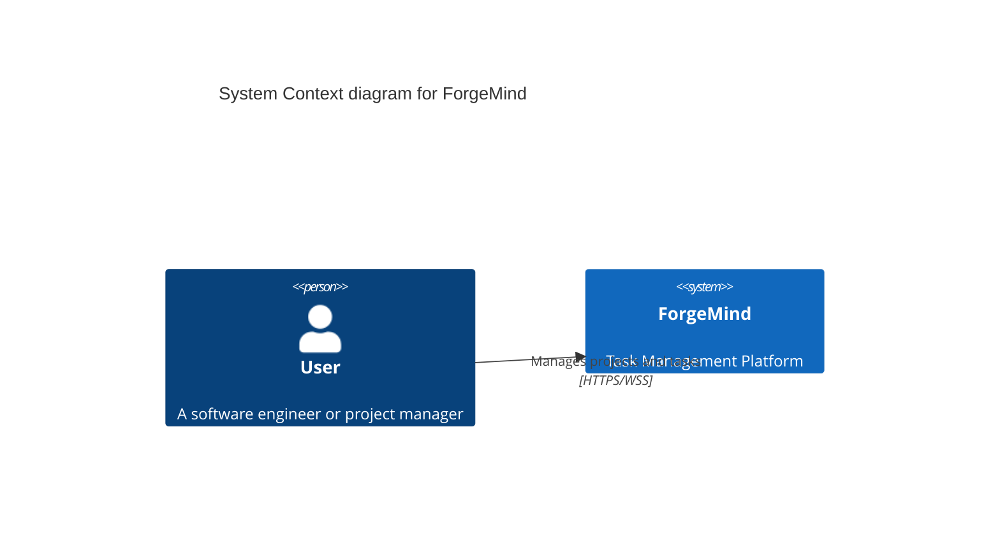
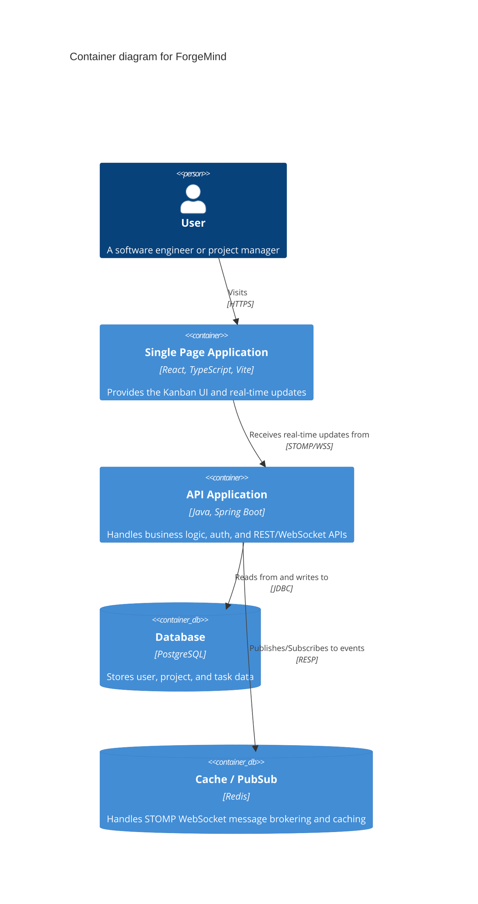
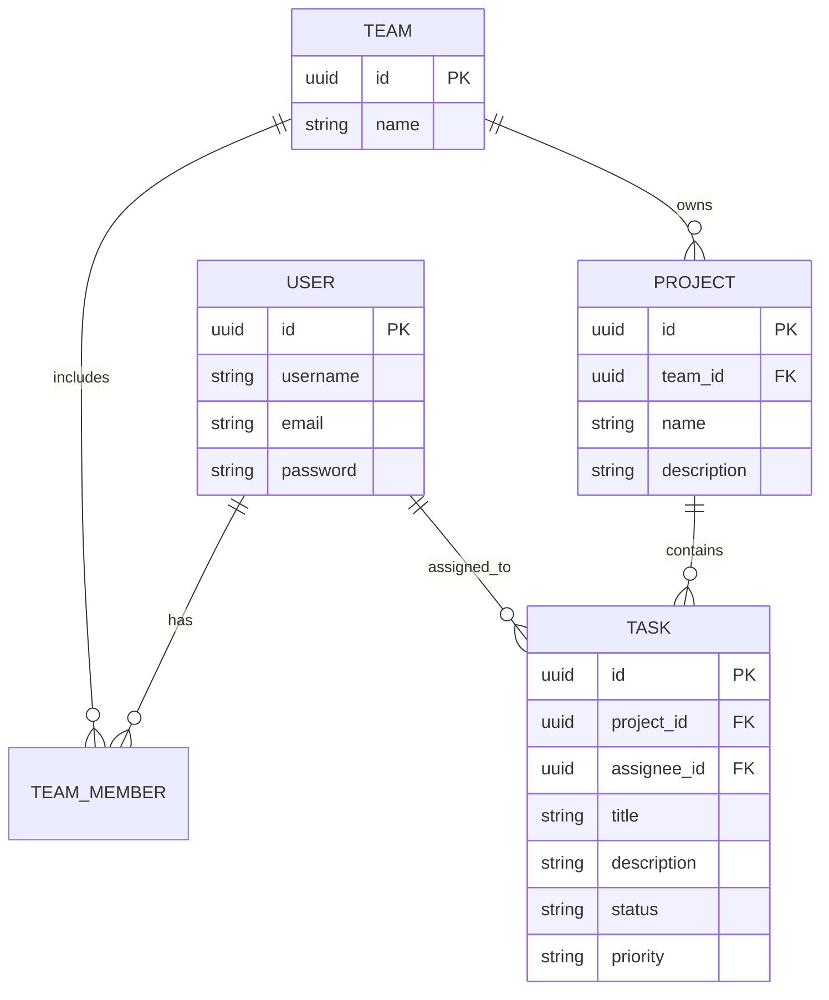
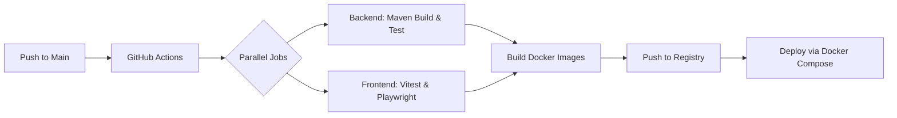

# ForgeMind Architecture

This document provides a high-level overview of the ForgeMind platform's architecture.

## System Context

ForgeMind is a Kanban Task Management system designed as a modern, real-time SaaS platform.



## Container Diagram

The system is broken down into a frontend SPA and a Spring Boot backend, backed by PostgreSQL and Redis.



## Data Model (Entity Relationship)



## CI/CD Pipeline

The project utilizes GitHub Actions for continuous integration and continuous deployment.



## Monitoring & Observability

ForgeMind uses Micrometer, Prometheus, and Grafana for monitoring application health, along with MDC-enriched structured logging for tracing.

```mermaid
graph TD
    A[Spring Boot API] -->|Exposes /actuator/prometheus| B(Prometheus)
    B -->|Scrapes Metrics| A
    C[Grafana] -->|Queries| B
    A -->|Structured Logs (MDC)| D(Log File/Fluentd)
```
