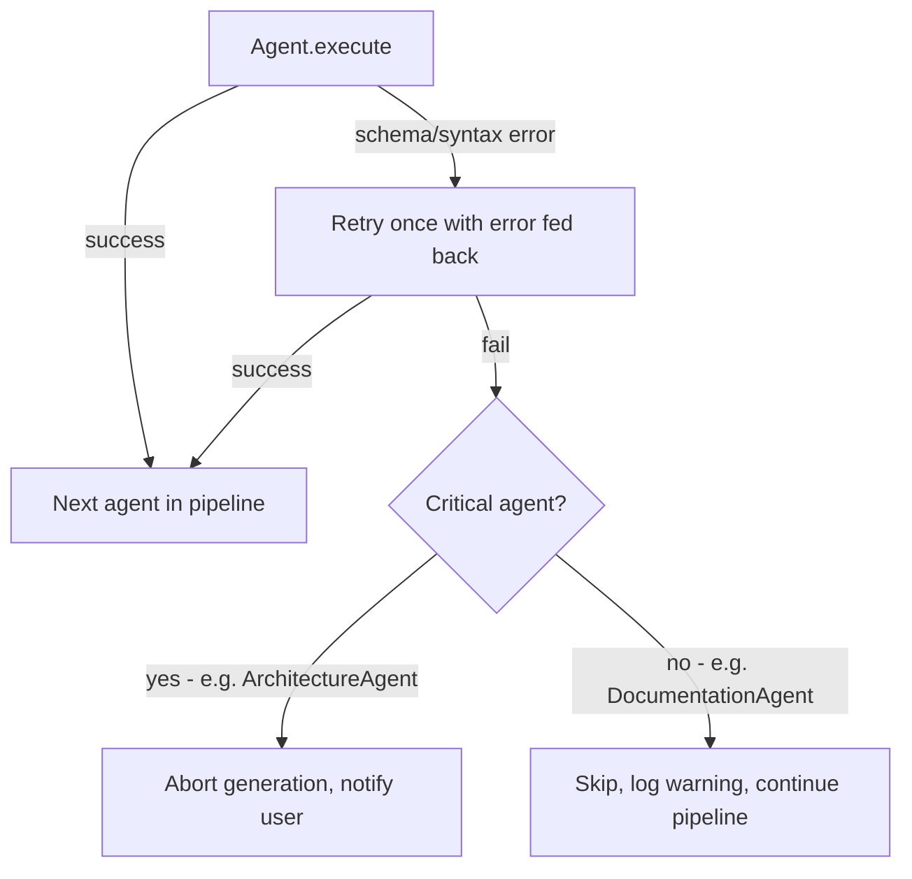

# ForgeMind — AI Agent Design

## Table of Contents
1. Overview
2. Common Agent Contract
3. RequirementAgent
4. PlanningAgent
5. ArchitectureAgent
6. DatabaseAgent
7. BackendAgent
8. FrontendAgent
9. DocumentationAgent
10. TestingAgent
11. ReviewAgent
12. DeploymentAgent
13. Failure Handling (Cross-Agent)
14. Implementation Notes
15. Future Considerations

---

## 1. Overview
This document details each agent from the roster in `07-ai-orchestration.md`: its responsibilities, inputs, outputs, prompt strategy, failure handling, and memory usage. Production-quality system prompts themselves live in `27-agent-prompts.md`.

---

## 2. Common Agent Contract

Every agent implements the same interface shape (illustrative, not implementation):

```
interface Agent<I, O> {
    O execute(I input, GenerationContext ctx);
    String name();
}
```

| Aspect | Common Rule |
|---|---|
| Inputs | Always include `GenerationContext` (projectId, relevant memory snapshot, prior agent outputs) |
| Outputs | Always a structured object (never raw free text returned to the orchestrator) |
| Memory | Read relevant memory at start, write decisions/outputs at end via `MemoryService` |
| Failure | Throws `AgentExecutionException`, caught by the Orchestrator, subject to retry policy (`25-background-jobs.md`) |

---

## 3. RequirementAgent

| Aspect | Detail |
|---|---|
| Responsibilities | Parse free-text user input into structured requirements; ask clarifying questions when ambiguous |
| Inputs | Raw user prompt, conversation history (Wizard step 4, `17-pages.md`) |
| Outputs | `StructuredRequirements { features[], constraints[], targetUsers[], openQuestions[] }` |
| Prompt Strategy | Few-shot examples of well-structured requirements; explicit instruction to ask ≤3 clarifying questions at a time |
| Failure Handling | If output fails schema validation, re-prompt once with the validation error appended; else escalate to user-facing "couldn't understand requirements" state |
| Memory Usage | Writes `DECISION` memory entries explaining requirement interpretation choices |

---

## 4. PlanningAgent

| Aspect | Detail |
|---|---|
| Responsibilities | Produce a task breakdown and rough complexity/time estimate |
| Inputs | `StructuredRequirements` |
| Outputs | `ProjectPlan { milestones[], estimatedComplexity, estimatedHours }` |
| Prompt Strategy | Decomposition-style prompting ("list milestones, then tasks per milestone") |
| Failure Handling | Falls back to a template-based plan keyed by detected project type if generation fails twice |
| Memory Usage | Reads none beyond requirements; writes plan as `MODULE` memory |

---

## 5. ArchitectureAgent

| Aspect | Detail |
|---|---|
| Responsibilities | Design system architecture and component diagram, consistent with `02-architecture.md`'s reference pattern |
| Inputs | `ProjectPlan`, tech stack selection |
| Outputs | `ArchitectureDesign { pattern, modules[], componentDiagram (mermaid) }` |
| Prompt Strategy | Constrained generation: must select from supported tech stack (`11-tech-stack.md`), output mermaid syntax validated before acceptance |
| Failure Handling | Invalid mermaid syntax triggers a single regeneration attempt with the syntax error fed back |
| Memory Usage | Writes `ARCHITECTURE` memory type |

---

## 6. DatabaseAgent

| Aspect | Detail |
|---|---|
| Responsibilities | Design ERD and generate SQL migration files |
| Inputs | `ArchitectureDesign` |
| Outputs | `DatabaseSchema { tables[], migrationSql }` |
| Prompt Strategy | Schema-first prompting with explicit constraint rules (PKs as UUID, timestamps on every table) mirroring `12-er-diagrams.md` conventions |
| Failure Handling | SQL syntax validated against a dry-run parser before being written to the workspace; failure triggers regeneration with parser error appended |
| Memory Usage | Writes `DATABASE` memory type |

---

## 7. BackendAgent

| Aspect | Detail |
|---|---|
| Responsibilities | Generate backend controllers/services/repositories matching `21-backend-architecture.md`'s layering |
| Inputs | `ArchitectureDesign`, `DatabaseSchema` |
| Outputs | Generated file set (`FilePath → Content`) |
| Prompt Strategy | Per-file generation with the layered-architecture rules injected as constraints; one file per generation call to keep context bounded |
| Failure Handling | Compile failure routes into the Self-Healing loop (`36-self-healing.md`) before surfacing to the user |
| Memory Usage | Writes `FILE` memory entries per generated file with purpose + dependencies |

---

## 8. FrontendAgent

| Aspect | Detail |
|---|---|
| Responsibilities | Generate React components/pages matching `16-ui-architecture.md` and `19-design-system.md` conventions |
| Inputs | `ArchitectureDesign`, generated API surface from BackendAgent |
| Outputs | Generated file set |
| Prompt Strategy | Component-scoped generation; design-token usage enforced via prompt constraints (no hardcoded colors/spacing) |
| Failure Handling | TypeScript compile errors route into Self-Healing loop |
| Memory Usage | Writes `FILE` memory entries |

---

## 9. DocumentationAgent

| Aspect | Detail |
|---|---|
| Responsibilities | Generate README, API docs, architecture docs for the *generated* project (not ForgeMind itself) |
| Inputs | Outputs of Architecture/Database/Backend/Frontend agents |
| Outputs | Markdown documentation files |
| Prompt Strategy | Summarization-style prompting over structured agent outputs, not free generation |
| Failure Handling | Low-stakes; failure simply skips doc generation for that run and logs a warning |
| Memory Usage | Reads all prior memory types; writes none |

---

## 10. TestingAgent

| Aspect | Detail |
|---|---|
| Responsibilities | Generate unit and integration tests for generated backend/frontend code |
| Inputs | Generated file set from Backend/FrontendAgent |
| Outputs | Test file set |
| Prompt Strategy | Given-When-Then structured prompting per `43-unit-tests.md` standards |
| Failure Handling | Failing-to-compile tests route into Self-Healing; persistently failing tests are flagged in the review report rather than blocking generation |
| Memory Usage | Writes `FILE` memory entries for test files |

---

## 11. ReviewAgent

| Aspect | Detail |
|---|---|
| Responsibilities | Architecture, security, performance, and naming review of generated code (`37-code-review.md`) |
| Inputs | Full generated file set |
| Outputs | `ReviewReport { findings[], score }` |
| Prompt Strategy | Checklist-driven prompting, one checklist category per pass, results merged |
| Failure Handling | A failed review pass is treated as "no findings for that category" with a logged warning, not a blocking failure |
| Memory Usage | Reads `FILE`/`ARCHITECTURE`/`DATABASE` memory; writes none (output persisted via `ReviewService`) |

---

## 12. DeploymentAgent

| Aspect | Detail |
|---|---|
| Responsibilities | Generate Dockerfile, docker-compose, GitHub Actions workflows for the generated project |
| Inputs | `ArchitectureDesign`, tech stack |
| Outputs | Deployment artifact file set |
| Prompt Strategy | Template-grounded generation (`39-docker.md`, `40-cicd.md` patterns), not free-form |
| Failure Handling | Falls back to a known-good template for the detected stack if generation fails twice |
| Memory Usage | Writes `FILE` memory entries |

---

## 13. Failure Handling (Cross-Agent)



"Critical" agents (Requirement, Architecture, Database, Backend, Frontend) abort the pipeline on unrecoverable failure; "supporting" agents (Documentation, Testing, Review, Deployment) degrade gracefully.

---

## 14. Implementation Notes
- Agents are stateless Spring beans; all state lives in `GenerationContext` (passed explicitly) or `MemoryService` (persisted) — never in agent instance fields, since agents are singleton-scoped and serve concurrent requests.
- Each agent's prompt template is externalized (not inlined in Java code) per `27-agent-prompts.md`, enabling prompt iteration without recompilation.

## 15. Future Considerations
- Introduce a `SecurityAgent` as a dedicated specialist split out of `ReviewAgent` once security-review depth outgrows a single checklist pass (`48-roadmap.md`).
