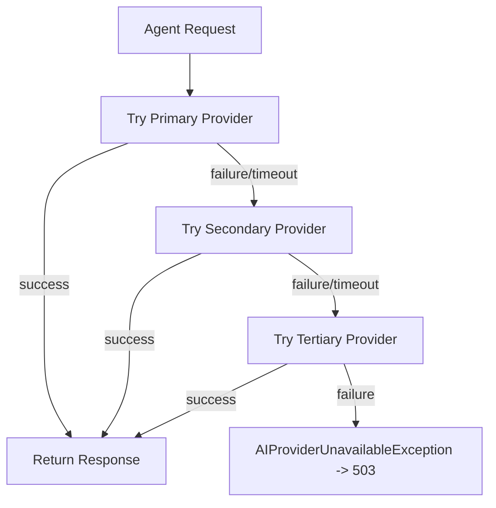
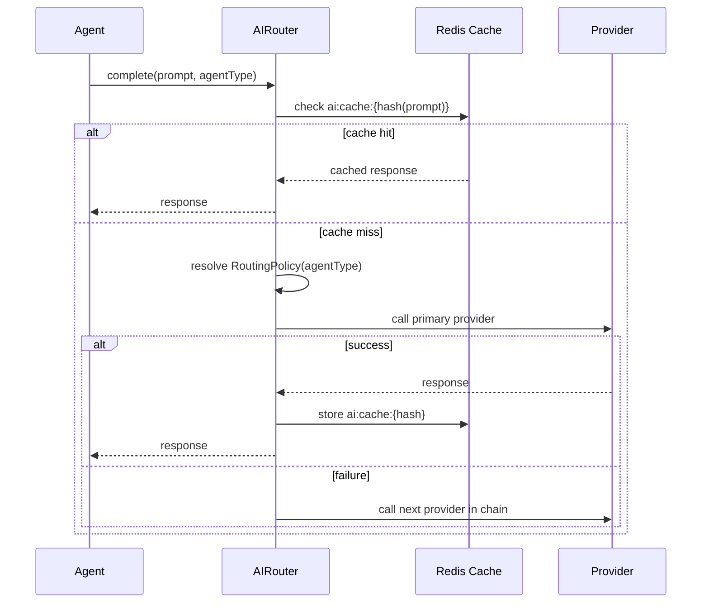

# ForgeMind — AI Provider Router

## Table of Contents
1. Overview
2. Provider Abstraction
3. Selection Rules
4. Fallback Strategy
5. Retry Policy
6. Cost Optimization
7. Latency Optimization
8. Routing Decision Flow
9. Implementation Notes
10. Future Considerations

---

## 1. Overview
The AI Router sits between Agents and the four supported providers (`07-ai-orchestration.md`, `11-tech-stack.md`), deciding which provider handles a given request and how to recover when a provider fails.

---

## 2. Provider Abstraction

```
interface AIProvider {
    StreamingResponse complete(Prompt prompt, CompletionOptions options);
    String getModel();
    int getTokenLimit();
    ProviderCostProfile getCostProfile();
    ProviderLatencyProfile getLatencyProfile();
}
```

| Provider | Strengths | Typical Role |
|---|---|---|
| Gemini | Strong long-context reasoning | Requirement/Planning/Architecture agents |
| Groq | Very low inference latency | Backend/Frontend agents (high call volume) |
| OpenRouter | Model diversity, aggregator fallback | Secondary fallback across all agents |
| Ollama | Free, local, no external network call | Local/dev environments, offline fallback |

---

## 3. Selection Rules

Routing is configured per-agent via a `RoutingPolicy`, not hardcoded in agent code:

| Agent | Primary | Secondary | Tertiary |
|---|---|---|---|
| RequirementAgent | Gemini | OpenRouter | Ollama (dev only) |
| PlanningAgent | Gemini | OpenRouter | Ollama (dev only) |
| ArchitectureAgent | Gemini | OpenRouter | Ollama (dev only) |
| DatabaseAgent | Groq | Gemini | OpenRouter |
| BackendAgent | Groq | OpenRouter | Gemini |
| FrontendAgent | Groq | OpenRouter | Gemini |
| DocumentationAgent | Gemini | OpenRouter | Ollama (dev only) |
| TestingAgent | Groq | OpenRouter | Gemini |
| ReviewAgent | Gemini | OpenRouter | Groq |
| DeploymentAgent | Groq | Gemini | OpenRouter |

`local`/`dev` Spring profile forces Ollama as primary for all agents regardless of the table above, to avoid burning paid quota during development.

---

## 4. Fallback Strategy



- "Failure" includes: non-2xx response, timeout (configurable per provider, default 30s for non-streaming calls), or malformed response that fails schema validation.
- Each fallback hop is logged with the failure reason for observability and cost/latency-profile tuning.

---

## 5. Retry Policy
- **Within a provider:** up to 2 immediate retries for transient errors (HTTP 429/503), with jittered backoff (200ms–800ms) — distinct from the agent-level retry in `26-agent-design.md` which concerns *output quality*, not transport failures.
- **Across providers:** no retry — a provider failure immediately falls through to the next provider per the fallback chain (§4), since retrying the *same* provider rarely resolves an outage.
- Circuit breaker: a provider with >50% failure rate over a rolling 5-minute window is marked "open" and skipped for 60 seconds before being retried, to avoid hammering a degraded provider.

---

## 6. Cost Optimization
- Each provider's `ProviderCostProfile` (cost per 1K input/output tokens) is used to prefer the cheaper provider when two candidates have equivalent suitability for an agent's task.
- Identical prompts (hashed) are cached in Redis (`ai:cache:{hash}`, TTL 6h, `03-database.md`) — a cache hit avoids any provider call entirely.
- Token-budget guardrails: agents truncate/summarize context (`30-context-management.md`) before sending, since cost scales with tokens regardless of provider.

---

## 7. Latency Optimization
- Agents on the critical path of perceived responsiveness (Backend/Frontend, generating many files) default to Groq specifically for its low time-to-first-token, improving the live `agent.output` streaming experience (`14-websocket-api.md`).
- The Router maintains a rolling p50/p95 latency profile per provider (`ProviderLatencyProfile`) used to deprioritize a provider that's currently slow, independent of its configured primary/secondary rank.

---

## 8. Routing Decision Flow



---

## 9. Implementation Notes
- `RoutingPolicy` is externalized configuration (`application.yml` or a dedicated `routing-policy.yml`), not hardcoded, so provider priority can change without a redeploy of agent logic.
- All provider calls go through the Router — agents never instantiate an `AIProvider` directly, preserving the abstraction boundary from `07-ai-orchestration.md`.

## 10. Future Considerations
- Dynamic, learned routing (bandit algorithm) that adjusts primary/secondary ranking based on observed `ReviewAgent` scores per provider, once enough generation volume exists for statistically meaningful comparison.
