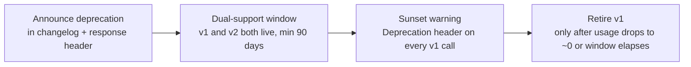

# ForgeMind — API Versioning Strategy

## Table of Contents
1. Overview
2. Versioning Scheme
3. Compatibility Rules
4. Deprecation Process
5. Error Response Format
6. Version Lifecycle
7. Implementation Notes
8. Future Considerations

---

## 1. Overview
ForgeMind's REST API is versioned via URI path segment (`/api/v1`, established in `04-api-design.md`). This document defines how the API evolves without breaking existing clients (CLI tools, third-party integrations, and the first-party frontend).

---

## 2. Versioning Scheme
- **Major version in the URL path**: `/api/v1/...`, `/api/v2/...`. A new major version is created only for breaking changes.
- **Minor/patch changes are non-versioned**: additive fields, new optional query params, and new endpoints ship within the current major version without a version bump.
- WebSocket destinations are versioned implicitly via the event `event` field's schema; breaking event-payload changes require a new event name (e.g., `agent.output.v2`) rather than a global WS version bump.

---

## 3. Compatibility Rules

A change is **non-breaking** (safe within `v1`) if it:
- Adds a new endpoint.
- Adds a new optional request field with a sensible default.
- Adds a new response field.
- Adds a new enum value that clients are expected to handle gracefully (documented as "open enum").

A change is **breaking** (requires `v2`) if it:
- Removes or renames a field, endpoint, or enum value.
- Changes a field's type or semantics.
- Changes default behavior in a way that alters existing client outcomes.
- Tightens validation in a way that rejects previously-valid requests.

| Change Type | v1-safe? |
|---|---|
| Add `GET /projects/{id}/tags` | Yes |
| Add optional `tags` field to project response | Yes |
| Rename `tech_stack` → `stack` | No — requires v2 |
| Change `status` enum values | No — requires v2 (or additive new value only) |
| Add stricter email validation on register | No — treat as breaking, ship behind a feature flag first |

---

## 4. Deprecation Process



- Deprecated endpoints return a `Deprecation: true` and `Sunset: <date>` HTTP header (RFC 8594 style).
- Minimum 90-day dual-support window for any major version retirement, communicated via the `README.md` changelog and in-app notice to API consumers.
- Internal (first-party frontend) consumers are migrated first in a feature-flagged rollout before external deprecation notices go out.

---

## 5. Error Response Format

Standard error envelope across all versions:

```json
{
  "error": {
    "code": "VALIDATION_ERROR",
    "message": "email must be a valid email address",
    "status": 400,
    "path": "/api/v1/auth/register",
    "timestamp": "2026-06-27T10:00:00Z",
    "details": [
      { "field": "email", "issue": "invalid_format" }
    ]
  }
}
```

| HTTP Status | Code | Meaning |
|---|---|---|
| 400 | `VALIDATION_ERROR` | Request body/params failed validation |
| 401 | `UNAUTHORIZED` | Missing/invalid JWT |
| 403 | `FORBIDDEN` | Authenticated but lacks permission |
| 404 | `NOT_FOUND` | Resource does not exist or not owned by caller |
| 409 | `CONFLICT` | Duplicate resource (e.g., email already registered) |
| 422 | `UNPROCESSABLE` | Semantically invalid (e.g., generating on a non-DRAFT project) |
| 429 | `RATE_LIMITED` | Too many requests |
| 500 | `INTERNAL_ERROR` | Unhandled server error |
| 503 | `AI_PROVIDER_UNAVAILABLE` | All configured AI providers failed (`28-ai-router.md`) |

This format is implemented as a single `@ControllerAdvice` (`21-backend-architecture.md`) so every controller returns errors consistently without per-endpoint boilerplate.

---

## 6. Version Lifecycle

| Stage | Description |
|---|---|
| Active | Fully supported, receives new non-breaking features |
| Deprecated | Still functional, returns deprecation headers, no new features |
| Sunset | Returns `410 Gone` with a pointer to the current version |

---

## 7. Implementation Notes
- Version negotiation is path-based only — no `Accept` header versioning — to keep routing simple and cache-friendly at the reverse proxy (`10-deployment-architecture.md`).
- Controllers for a new major version live in a parallel package (`modules/{feature}/v2/`) rather than branching logic inside `v1` controllers, per `23-package-structure.md`.

## 8. Future Considerations
- If/when GraphQL is introduced (`11-tech-stack.md` future note), it will version via schema deprecation directives rather than URL path, and this document will be extended accordingly.
