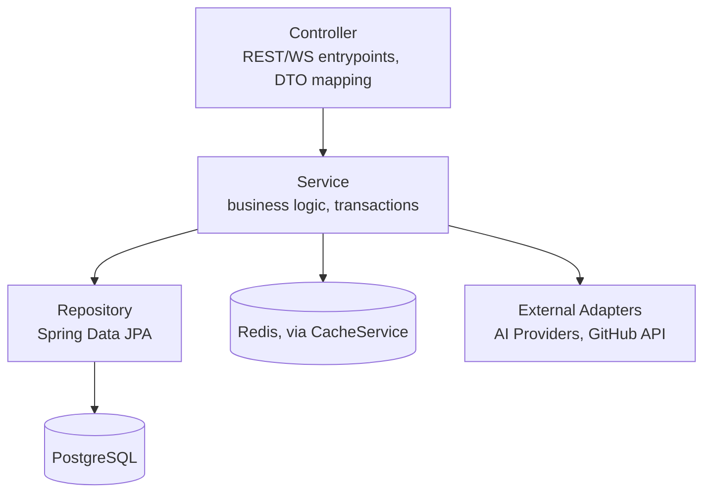
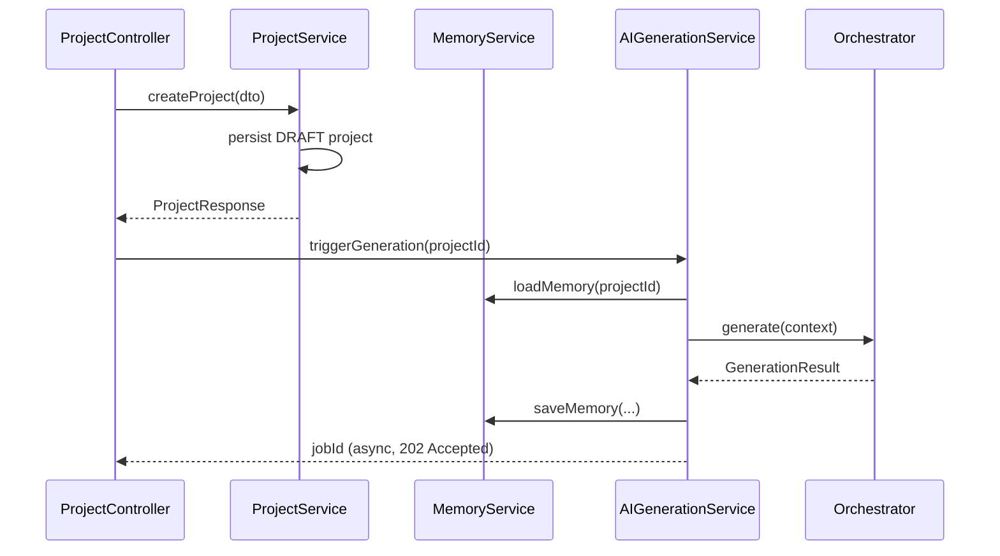

# ForgeMind — Backend Architecture

## Table of Contents
1. Overview
2. Layered Architecture
3. Clean Architecture Mapping
4. Package Organization
5. Dependency Rules
6. Service Interaction Patterns
7. Exception Handling
8. Validation
9. Implementation Notes
10. Future Considerations

---

## 1. Overview
The backend (Spring Boot, Java 21, `02-architecture.md`) is organized as a **modular monolith**: package-by-feature modules, each internally layered, with strict dependency rules preventing the tangled coupling that would otherwise emerge across hundreds of classes.

---

## 2. Layered Architecture

Every module follows the same internal layering:



| Layer | Responsibility | Never Does |
|---|---|---|
| Controller | HTTP/WS binding, request validation, DTO ↔ domain mapping | Contain business logic |
| Service | Orchestrates business rules, transaction boundaries (`@Transactional`) | Know about HTTP status codes |
| Repository | Data access only (Spring Data JPA interfaces) | Contain business logic |
| Domain/Entity | JPA entities, value objects | Leak outside the Service layer as API responses |

---

## 3. Clean Architecture Mapping

| Clean Architecture Ring | ForgeMind Equivalent |
|---|---|
| Entities | JPA entities (`User`, `Project`, `Generation`, ...) + domain value objects |
| Use Cases | Service classes (`ProjectService.createProject(...)`) |
| Interface Adapters | Controllers (inbound), Repository interfaces (outbound) |
| Frameworks & Drivers | Spring Boot, PostgreSQL driver, Redis client, AI provider SDKs |

Dependencies point **inward**: Controllers depend on Services, Services depend on Repository *interfaces* (not implementations), never the reverse. AI provider SDKs are isolated behind the `AIProvider` interface (`07-ai-orchestration.md`) so the Service layer never imports a vendor SDK type directly.

---

## 4. Package Organization

```
backend/src/main/java/com/forgemind/
├── modules/
│   ├── auth/
│   │   ├── controller/
│   │   ├── service/
│   │   ├── repository/
│   │   ├── domain/
│   │   └── dto/
│   ├── projects/
│   │   ├── controller/ service/ repository/ domain/ dto/
│   ├── workspace/
│   ├── memory/
│   ├── ai/
│   │   ├── orchestrator/
│   │   ├── agents/
│   │   ├── providers/
│   │   └── dto/
│   ├── review/
│   ├── deployment/
│   └── templates/
├── config/                  Security, CORS, WebSocket, Jackson config
├── common/                  Shared DTOs, exceptions, utilities
└── ForgemindApplication.java
```

Full enterprise package layout (with sub-package rationale) is detailed in `23-package-structure.md`.

---

## 5. Dependency Rules

| Rule | Enforcement |
|---|---|
| Controllers depend only on Services in the same module | Code review + ArchUnit test |
| Services may depend on other modules' Services (never their Repositories) | ArchUnit test forbidding cross-module repository imports |
| No module depends on `ai.providers` directly except `ai.agents` | ArchUnit test |
| `common/` has zero dependencies on any `modules/*` package | ArchUnit test (prevents circular deps) |
| Entities are never returned directly from Controllers | Code review checklist (`46-coding-standards.md`) |

ArchUnit tests run in CI (`44-integration-tests.md`) and fail the build on violation — this is how the dependency rules stay enforced as the codebase grows toward hundreds of classes.

---

## 6. Service Interaction Patterns



Cross-module calls go through public Service interfaces only; modules never share entity classes — DTOs cross module boundaries, matching the controller-boundary rule for external API consumers.

---

## 7. Exception Handling

A single `@RestControllerAdvice` (`common/exception/GlobalExceptionHandler`) converts all exceptions to the standard error envelope defined in `15-api-versioning.md`:

| Exception | Mapped Status |
|---|---|
| `ResourceNotFoundException` | 404 |
| `AccessDeniedException` (Spring Security) | 403 |
| `ValidationException` (custom, wraps Bean Validation errors) | 400 |
| `ConflictException` | 409 |
| `AIProviderUnavailableException` | 503 |
| Unhandled `RuntimeException` | 500 (logged with full stack trace + correlation ID) |

Domain-specific exceptions live in each module's `domain/exception/` sub-package and extend a shared `ForgemindException` base, never raw `RuntimeException`.

---

## 8. Validation
- **Request-level:** Bean Validation (`@Valid`, `@NotBlank`, `@Email`, custom validators) on DTOs at the Controller boundary.
- **Business-rule-level:** Enforced in the Service layer (e.g., "cannot trigger generation on a DEPLOYED project") and raises domain exceptions, not Bean Validation annotations.
- **Database-level:** Constraints from `12-er-diagrams.md` act as the last line of defense, never the primary validation mechanism.

---

## 9. Implementation Notes
- Every Service method that mutates state is `@Transactional`; read-only methods are `@Transactional(readOnly = true)` for query optimization.
- Module boundaries are physical (separate top-level packages) specifically so they can later be extracted into separate deployables without restructuring (`23-package-structure.md`, `48-roadmap.md`).

## 10. Future Considerations
- Introduce a lightweight internal event bus (Spring `ApplicationEventPublisher`) for cross-module notifications (e.g., Review Module reacting to `GenerationCompletedEvent`) instead of direct service calls, to further decouple modules as agent count grows.
