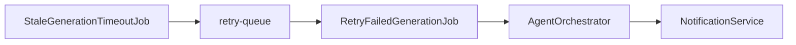

# ForgeMind — Background Jobs

## Table of Contents
1. Overview
2. Job Categories
3. Scheduled Tasks
4. Queues
5. Retry Policy
6. Notifications Integration
7. Cleanup Jobs
8. Implementation Notes
9. Future Considerations

---

## 1. Overview
Not all work in ForgeMind happens synchronously within an HTTP request. This document defines scheduled and queued background work, living in `modules/jobs/` (`23-package-structure.md`).

---

## 2. Job Categories

| Category | Mechanism | Example |
|---|---|---|
| Scheduled (cron-like) | Spring `@Scheduled` | Nightly cleanup of orphaned workspace files |
| Queued (async, triggered) | Spring `@Async` + Redis-backed queue | Long-running generation retries |
| Event-driven | `@EventListener` (`21-backend-architecture.md`) | Notification dispatch on `GenerationCompletedEvent` |

---

## 3. Scheduled Tasks

| Job | Schedule | Responsibility |
|---|---|---|
| `OrphanedWorkspaceCleanupJob` | Daily, 02:00 UTC | Delete workspace files for projects deleted >30 days ago |
| `StaleGenerationTimeoutJob` | Every 5 minutes | Mark `GENERATING` jobs with no progress in 15min as `FAILED`, trigger retry |
| `TemplateDownloadCountSyncJob` | Hourly | Reconcile Redis-cached download counters into PostgreSQL |
| `SessionExpiryCleanupJob` | Daily, 03:00 UTC | Purge expired refresh-token entries from Redis (defensive; TTL should already expire them) |
| `BackupVerificationJob` | Weekly | Confirm latest DB snapshot is restorable (paired with `13-migrations.md` §7) |

---

## 4. Queues
- Redis-backed simple queue (list-based) for generation retries and review-pipeline re-runs; chosen over a full message broker (Kafka/RabbitMQ) given current scale — revisited in Future Considerations.
- Queue consumers run as `@Async` Spring beans with a bounded thread pool (`taskExecutor`, max 10 concurrent for AI-related jobs to respect provider rate limits, `28-ai-router.md`).

---

## 5. Retry Policy

| Job Type | Max Retries | Backoff |
|---|---|---|
| AI generation step | 3 | Exponential: 5s, 30s, 2min |
| AI provider call (within an agent) | 2 | Immediate fallback to next provider (`28-ai-router.md`), not a delayed retry |
| Build execution | 1 | Immediate |
| Notification dispatch | 5 | Exponential, capped at 1min |

After exhausting retries, the job is marked `FAILED`, an `error` WebSocket event is emitted (`14-websocket-api.md`), and a `GenerationFailedEvent` is published for audit logging.

---

## 6. Notifications Integration
- Background jobs never push directly to WebSocket clients; they publish domain events, and `NotificationService` (`22-services.md`) is the sole consumer responsible for both persisting and pushing notifications — keeping a single notification fan-out path regardless of trigger source.

---

## 7. Cleanup Jobs

| Job | Removes |
|---|---|
| `OrphanedWorkspaceCleanupJob` | Workspace files for soft-deleted projects past retention |
| `StaleSessionCleanupJob` | Expired Redis session/refresh-token keys |
| `IncompleteGenerationCleanupJob` | Partial file writes from failed generations that exceeded retry budget |
| `ExpiredCacheCleanupJob` | Defensive sweep of `ai:cache:*` keys beyond TTL (Redis TTL should handle this; job exists for monitoring) |

---

## 8. Implementation Notes
- All scheduled jobs are idempotent — re-running a job after a crash mid-execution must not corrupt state (e.g., cleanup jobs check existence before delete, retries check current job status before acting).
- Job execution is logged with a correlation ID matching the `jobId` where applicable, for traceability into the same logs used by `14-websocket-api.md` error events.
- In multi-instance deployments (`10-deployment-architecture.md`), `@Scheduled` jobs use a distributed lock (Redis-based, e.g., ShedLock) to prevent duplicate execution across instances.

## 9. Future Considerations
- Migrate from the Redis list-based queue to a proper message broker (e.g., RabbitMQ or Kafka) if job volume/throughput requirements grow significantly, particularly once `AIGenerationService` is extracted per `48-roadmap.md`.
- Add a job dashboard (admin-only page) for visibility into queue depth and failure rates.
