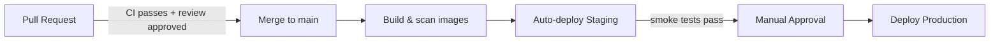
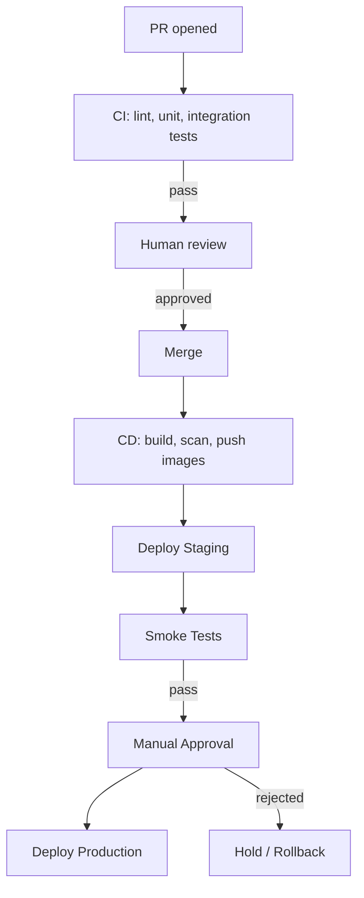

# ForgeMind — CI/CD Design

## Table of Contents
1. Overview
2. Pipeline Stages
3. CI Workflow (Pull Request)
4. CD Workflow (Deploy)
5. Environment Promotion
6. Secrets in CI/CD
7. Pipeline Diagram
8. Implementation Notes
9. Future Considerations

---

## 1. Overview
CI/CD for the ForgeMind **platform itself** runs on GitHub Actions (`11-tech-stack.md`), separate from the GitHub integration feature (`38-github-integration.md`) used for users' generated projects.

---

## 2. Pipeline Stages

| Stage | Trigger | Purpose |
|---|---|---|
| Lint & Static Analysis | Every push/PR | Checkstyle/ESLint, ArchUnit rules (`21-backend-architecture.md`) |
| Unit Tests | Every push/PR | `43-unit-tests.md` suite |
| Integration Tests | Every push/PR | `44-integration-tests.md` suite (ephemeral DB/Redis via Testcontainers) |
| Build Images | On merge to `main` | Build + tag Docker images (`39-docker.md`) |
| Vulnerability Scan | After image build | Scan images before registry push |
| Deploy Staging | Automatic, on merge to `main` | Deploy to staging environment |
| Deploy Production | Manual approval gate | Deploy to production |

---

## 3. CI Workflow (Pull Request)

```yaml
name: ci
on: [pull_request]
jobs:
  backend:
    runs-on: ubuntu-latest
    steps:
      - uses: actions/checkout@v4
      - uses: actions/setup-java@v4
        with: { java-version: '21', distribution: 'temurin' }
      - run: mvn -B checkstyle:check
      - run: mvn -B test
      - run: mvn -B verify -Pintegration-tests   # Testcontainers-based

  frontend:
    runs-on: ubuntu-latest
    steps:
      - uses: actions/checkout@v4
      - uses: actions/setup-node@v4
        with: { node-version: '20' }
      - run: npm ci
      - run: npm run lint
      - run: npm run type-check
      - run: npm run test
      - run: npm run build
```

PRs cannot merge unless both jobs pass (GitHub branch protection rule), and a minimum of one human approval is required regardless of CI status (`47-development-rules.md`).

---

## 4. CD Workflow (Deploy)

```yaml
name: cd
on:
  push:
    branches: [main]
jobs:
  build-and-push:
    runs-on: ubuntu-latest
    steps:
      - uses: actions/checkout@v4
      - run: docker build -t registry/forgemind-backend:${{ github.sha }} ./backend
      - run: docker build -t registry/forgemind-frontend:${{ github.sha }} ./frontend
      - run: trivy image registry/forgemind-backend:${{ github.sha }}
      - run: docker push registry/forgemind-backend:${{ github.sha }}
      - run: docker push registry/forgemind-frontend:${{ github.sha }}

  deploy-staging:
    needs: build-and-push
    runs-on: ubuntu-latest
    steps:
      - run: ./scripts/deploy.sh staging ${{ github.sha }}

  deploy-production:
    needs: deploy-staging
    runs-on: ubuntu-latest
    environment:
      name: production    # GitHub Environments manual-approval gate
    steps:
      - run: mvn -B flyway:migrate -Dflyway.url=$PROD_DB_URL   # pre-deploy migration, 13-migrations.md
      - run: ./scripts/deploy.sh production ${{ github.sha }}
```

---

## 5. Environment Promotion



- Staging deploys automatically and immediately after every merge to `main` — staging is meant to be a continuously up-to-date preview, not a gated environment.
- Production requires a human approval via GitHub Environments' protection rules, gated on staging smoke tests passing.

---

## 6. Secrets in CI/CD
- All secrets (registry credentials, `PROD_DB_URL`, AI provider keys for any CI smoke tests) are stored as GitHub Actions encrypted secrets, scoped to the `production` Environment where applicable so PR-triggered workflows (which don't have Environment access) cannot read production secrets — defending against secret exfiltration via a malicious PR.
- No secret is ever printed to workflow logs; GitHub Actions automatically masks known secret values, and scripts avoid `echo`-ing secret variables defensively.

---

## 7. Pipeline Diagram



---

## 8. Implementation Notes
- Database migrations (`13-migrations.md`) run as an explicit pre-deploy CI step for production, never as part of application startup in that environment, so a bad migration is caught before traffic shifts to new application code.
- Rollback is image-based: redeploying the previous known-good image tag; destructive-migration safety (`13-migrations.md` §5) ensures this is always safe.

## 9. Future Considerations
- Canary or blue/green deployment strategy for production once multi-instance load justifies the added pipeline complexity (`10-deployment-architecture.md` Future Considerations).
- Automated rollback triggered by post-deploy health-check/error-rate regression, rather than relying solely on manual intervention.
