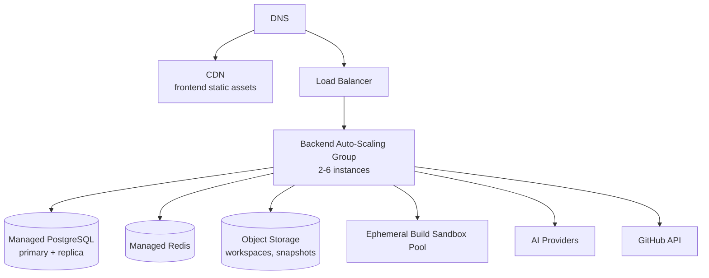

# ForgeMind — Cloud Deployment Architecture

## Table of Contents
1. Overview
2. Target Topology
3. Compute
4. Data Layer
5. Storage Layer
6. Networking & Edge
7. Observability
8. Scaling Strategy
9. Disaster Recovery
10. Implementation Notes
11. Future Considerations

---

## 1. Overview
This document specifies the production cloud deployment, expanding `10-deployment-architecture.md` §4 and §11 with operational detail (scaling, observability, DR).

---

## 2. Target Topology

Cloud-agnostic naming is used deliberately (`ALB`, `RDS`-style managed services, `S3`-style object storage) since ForgeMind's deployment scripts (`40-cicd.md`) target standard primitives available across major providers, avoiding lock-in to one cloud vendor's proprietary services beyond these common categories.

---

## 3. Compute
- Backend runs as a fleet of stateless instances behind a load balancer in an auto-scaling group, scaling on CPU utilization and request queue depth.
- Minimum 2 instances at all times for high availability; scales up to a configured maximum during generation-heavy load (AI orchestration is CPU-light but I/O/concurrency-heavy, benefiting from Java 21 virtual threads, `11-tech-stack.md`, more than from raw instance count alone).
- Build sandboxes (`39-docker.md`) run in a separate, isolated compute pool — never on the same instances serving API traffic, both for security isolation and so a burst of sandbox builds can't starve API responsiveness.

---

## 4. Data Layer
- Managed PostgreSQL: primary + 1 read replica; replica serves analytics/reporting queries (`17-pages.md` AnalyticsPage) to keep that load off the primary used for transactional writes.
- Managed Redis: single cluster, AOF persistence enabled for session/refresh-token durability across restarts.
- Connection pooling (HikariCP, backend-side) sized per instance to stay within the managed database's max-connections ceiling as instance count scales.

---

## 5. Storage Layer
- Object storage (S3-compatible) holds workspace files (`32-file-management.md`) and version snapshots, with server-side encryption enabled.
- Lifecycle policy: version snapshots older than a configurable retention window may transition to cheaper, infrequent-access storage tiers (not deleted, just tiered) — full deletion policy is project-deletion-driven (`13-migrations.md`-adjacent cascade), not age-driven.

---

## 6. Networking & Edge
- CDN serves the frontend static build with long cache TTLs on immutable, hashed asset filenames and short/no caching on `index.html`.
- TLS terminates at the load balancer/CDN edge; internal traffic between the LB and backend instances also uses TLS within the VPC for defense in depth.
- WebSocket connections require sticky sessions at the load balancer **or** the Redis-backed STOMP relay (`10-deployment-architecture.md` §6) — production uses the Redis relay so any instance can serve any WebSocket client, avoiding sticky-session constraints on auto-scaling.

---

## 7. Observability

| Signal | Tool/Approach |
|---|---|
| Logs | Structured JSON logs shipped to a centralized log aggregator |
| Metrics | `/actuator/metrics` + Micrometer, scraped by a metrics backend (e.g., Prometheus-compatible) |
| Traces | Correlation IDs (matching `jobId` where applicable) propagated through logs; distributed tracing evaluated as a Future Consideration |
| Alerts | Error-rate, latency p95/p99, AI provider failure-rate (`28-ai-router.md` circuit breaker state), DB connection pool saturation |

---

## 8. Scaling Strategy

| Dimension | Scaling Lever |
|---|---|
| API/WebSocket traffic | Horizontal — add backend instances |
| AI generation throughput | Horizontal — more instances + provider rate-limit-aware concurrency (`28-ai-router.md`) |
| Database read load | Read replica(s) |
| Database write load | Vertical scaling of primary first; partitioning (`12-er-diagrams.md` Future Considerations) if/when needed |
| Build sandbox demand | Horizontal — scale the isolated sandbox pool independently of API instances |

---

## 9. Disaster Recovery

| Scenario | Recovery Approach |
|---|---|
| Single instance failure | Load balancer health checks reroute traffic; auto-scaling replaces the instance |
| Database failure | Failover to read replica (promoted to primary) per managed-PostgreSQL provider's standard failover; PITR restore as a last resort (`13-migrations.md` §7) |
| Region-wide outage | Out of scope for current MVP; documented as a Future Consideration below |
| Accidental data deletion | Point-in-time restore from continuous WAL archiving (`13-migrations.md`) |

RTO/RPO targets and drill cadence are tracked in `45-security-checklist.md`.

---

## 10. Implementation Notes
- All infrastructure is provisioned via code (Terraform or equivalent) rather than manual console changes, so the topology in this document stays accurate and reproducible.
- Environment parity (staging mirrors production topology at smaller scale) is maintained specifically so deploy-time issues surface in staging, not production.

## 11. Future Considerations
- Multi-region active-passive deployment for disaster recovery and reduced latency for geographically distant users.
- Dedicated read-path caching layer (e.g., edge caching of `GET /projects` list responses) if dashboard read traffic becomes a meaningful scaling driver.
