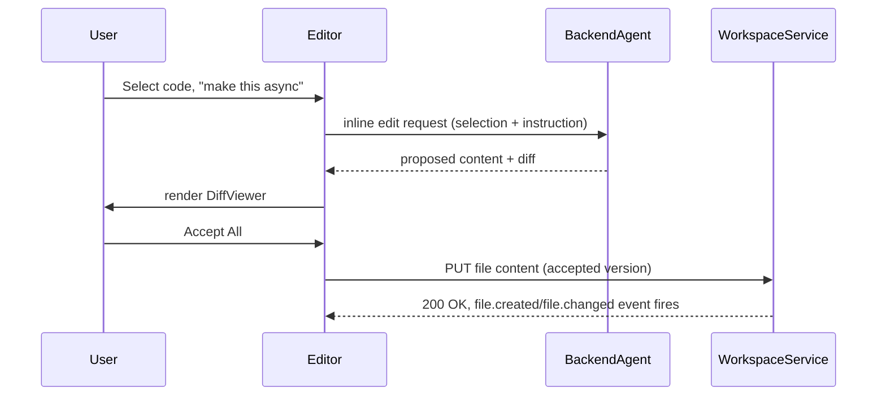

# ForgeMind — Monaco Code Editor Integration

## Table of Contents
1. Overview
2. Editor Setup
3. Autocomplete
4. Diff View
5. Search
6. AI Inline Editing
7. Sync With Workspace State
8. Implementation Notes
9. Future Considerations

---

## 1. Overview
This document covers the Monaco Editor integration powering the Editor panel in `31-workspace.md` and the `MonacoEditor` component in `18-components.md`.

---

## 2. Editor Setup
- Loaded via `@monaco-editor/react`, themed to follow ForgeMind's dark/light mode (`19-design-system.md`) using a custom theme definition matching the design token palette rather than Monaco's stock themes.
- Language detection by file extension, mapped to Monaco's built-in language services (Java, TypeScript/TSX, SQL, YAML, JSON, Markdown, Dockerfile).
- Editor instances are created per open tab (`EditorTabs`, `18-components.md`) and disposed on tab close to avoid memory growth as users open/close many files in a long session.

---

## 3. Autocomplete
- **TypeScript/TSX files:** Monaco's built-in TS language service, supplemented with the generated project's own `tsconfig.json`/type declarations loaded into Monaco's virtual file system so cross-file types resolve correctly.
- **Java files:** Monaco lacks a native Java language service; ForgeMind ships a lightweight completion provider backed by a simple symbol index (class/method names extracted from `workspace_files`/AST parse at write-time, `32-file-management.md`) — full semantic completion (go-to-definition across the whole project) is a Future Consideration, not MVP scope.
- **SQL files:** Basic keyword + table/column name completion sourced from the project's `DatabaseSchema` memory (`08-memory.md`).

---

## 4. Diff View
- `DiffViewer` (`18-components.md`) wraps Monaco's `DiffEditor` to render AI-proposed changes (from inline edits or surgical edits, `08-memory.md`) before the user accepts them.
- Diff is computed server-side (unified diff between current file content and the agent's proposed content) and passed to the client, rather than relying on client-side diffing — keeps diff computation consistent regardless of which agent produced the change.
- User actions on a diff: **Accept All**, **Accept Hunk**, **Reject**, **Edit then Accept** (opens the proposed version in a normal editable tab).

---

## 5. Search
- In-file search/replace via Monaco's native find widget (Ctrl/Cmd+F).
- Cross-file search (`FileSearchInput`, `18-components.md`) is a separate, project-wide search backed by a server-side endpoint over the file index (`32-file-management.md`), since Monaco's native search is scoped to the active editor only.
- Cross-file search results link directly to the matching line, opening the target file and scrolling/highlighting via Monaco's `revealLineInCenter` API.

---

## 6. AI Inline Editing
1. User selects a code range and invokes "Ask AI" (keyboard shortcut or floating toolbar, `InlineAIEditPrompt`, `18-components.md`).
2. The selection, surrounding context (configurable radius, default ±20 lines), file path, and user instruction are sent to `AIGenerationService` (`22-services.md`), which routes to BackendAgent/FrontendAgent in "inline edit" mode (a narrower-scoped variant of the standard generation prompt, `27-agent-prompts.md`).
3. Result renders as an inline diff (§4) directly in the editor, not a separate panel, keeping the user's attention in place.
4. Read-only lock (`31-workspace.md` §4) is applied to the file for the duration of the in-flight request to prevent concurrent edits from racing the AI's proposed change.

---

## 7. Sync With Workspace State
- Editor content is the source of truth for unsaved edits (held in React Query's cache via `setQueryData`, `20-state-management.md`); explicit Save (Ctrl/Cmd+S or auto-save after a debounce) persists via `PUT /api/v1/workspace/{id}/file`.
- Incoming `file.created`/file-changed WebSocket events for the **currently open** file trigger a non-destructive prompt ("This file was updated by AI — reload?") rather than silently overwriting unsaved user edits.

---

## 8. Implementation Notes
- Monaco's web workers (for language services) are loaded from the app's own static assets, not a CDN, to keep the Workspace functional without third-party network dependencies (consistent with the offline-friendly stance reflected in Ollama support, `28-ai-router.md`).
- Editor performance for very large files (>5,000 lines) uses Monaco's built-in virtualization; no custom virtualization layer is needed.

## 9. Future Considerations
- Full semantic Java language server (LSP) integration for true go-to-definition/find-references across the generated backend, once justified by user demand.
- Collaborative cursors (multi-user editing) building on the same infrastructure noted in `31-workspace.md`'s Future Considerations.
