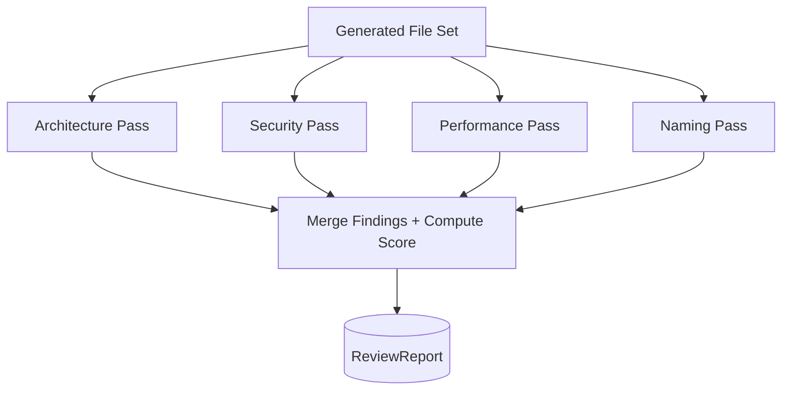

# ForgeMind — Automated Code Review Pipeline

## Table of Contents
1. Overview
2. Review Categories
3. Architecture Review
4. Security Review
5. Performance Review
6. Naming Review
7. Scoring Model
8. Review Report Structure
9. Pipeline Diagram
10. Implementation Notes
11. Future Considerations

---

## 1. Overview
ReviewAgent (`26-agent-design.md`) runs four independent checklist passes over generated code, producing the `ReviewReport` persisted by `ReviewService` (`22-services.md`) and surfaced wherever review findings appear in the UI (`18-components.md`'s `FindingCard`/`ScoreGauge`).

---

## 2. Review Categories

| Category | Question It Answers |
|---|---|
| Architecture | Does the code follow `21-backend-architecture.md`/`16-ui-architecture.md`'s layering and module rules? |
| Security | Does the code follow `24-security.md`'s baseline practices? |
| Performance | Are there obvious inefficiencies (N+1 queries, unnecessary re-renders, missing indexes)? |
| Naming | Does the code follow `46-coding-standards.md`'s naming conventions? |

Each category runs as a **separate** prompt pass (`27-agent-prompts.md`), never combined, so findings stay precise and don't dilute across concerns.

---

## 3. Architecture Review
Checks:
- Controllers contain no business logic.
- Services don't directly reference other modules' repositories.
- Frontend pages remain thin containers; logic lives in hooks/services.
- New files are placed in the correct package/folder per `23-package-structure.md`.

---

## 4. Security Review
Checks:
- No hardcoded secrets/credentials in generated code.
- Input validation present on all controller endpoints accepting user input.
- SQL is parameterized (no string-concatenated queries) — relevant since generated SQL/JPQL must never be vulnerable to injection.
- Authorization checks (`@PreAuthorize` or service-level ownership checks) present on any endpoint touching user-owned resources.
- No sensitive data (passwords, tokens) logged.

---

## 5. Performance Review
Checks:
- No N+1 query patterns in JPA repository usage (missing `@EntityGraph`/fetch joins where clearly needed).
- Indexes exist (per `12-er-diagrams.md` recommendations) for columns used in generated `WHERE`/`ORDER BY` clauses.
- React components avoid obviously unnecessary re-renders (e.g., inline object/array literals passed as props to memoized children, missing `useMemo`/`useCallback` where a hot path clearly needs it).
- No unbounded list rendering without pagination/virtualization for potentially large datasets.

---

## 6. Naming Review
Checks:
- Java classes/methods/variables follow `46-coding-standards.md` conventions (PascalCase classes, camelCase methods, etc.).
- React components/hooks follow naming conventions (`23-package-structure.md` §4).
- DTO suffix conventions (`Request`/`Response`) are respected.
- No abbreviated/ambiguous names where a clear name was available.

---

## 7. Scoring Model
Each category produces a `categoryScore` (0–100, per `27-agent-prompts.md`'s ReviewAgent output schema). Overall `score` is a weighted average:

| Category | Weight |
|---|---|
| Architecture | 30% |
| Security | 35% |
| Performance | 20% |
| Naming | 15% |

Security is weighted highest, reflecting that security findings carry the highest real-world cost if missed. Any single `CRITICAL` security finding caps the overall score at 50 regardless of other categories, to ensure critical issues are never visually "averaged away."

---

## 8. Review Report Structure

```json
{
  "projectId": "uuid",
  "score": 87,
  "findings": [
    {
      "category": "SECURITY",
      "filePath": "backend/.../WishlistController.java",
      "severity": "MEDIUM",
      "issue": "Endpoint lacks @PreAuthorize check for resource ownership",
      "recommendation": "Add ownership verification in WishlistService before returning data"
    }
  ],
  "categoryScores": {
    "ARCHITECTURE": 95,
    "SECURITY": 80,
    "PERFORMANCE": 90,
    "NAMING": 100
  },
  "createdAt": "2026-06-27T10:00:00Z"
}
```

This maps directly to `review_reports.findings` (JSONB) and `review_reports.score` in `12-er-diagrams.md`.

---

## 9. Pipeline Diagram



Passes run concurrently (independent of each other), then results are merged — consistent with the non-critical, parallelizable nature of Stage 11 in `34-project-generation.md`.

---

## 10. Implementation Notes
- Review runs automatically after every full generation (`34-project-generation.md`) and every surgical edit (`35-project-editing.md`), not just on-demand, so the score is always current.
- A manual "re-run review" action is available from `ProjectExplorer` (`17-pages.md`) for cases where the automatic pass failed or the user wants a fresh check after manual edits made directly in the editor.

## 11. Future Considerations
- A dedicated `SecurityAgent` (noted in `26-agent-design.md` Future Considerations) to deepen the Security pass beyond a single checklist prompt.
- Historical score trending per project, shown on `AnalyticsPage` (`17-pages.md`), once enough review history accumulates.
