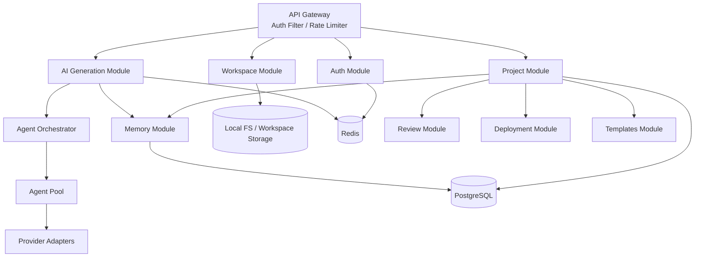
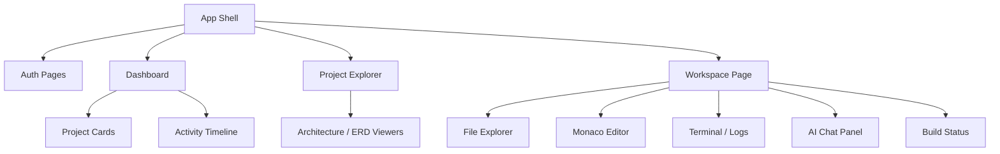
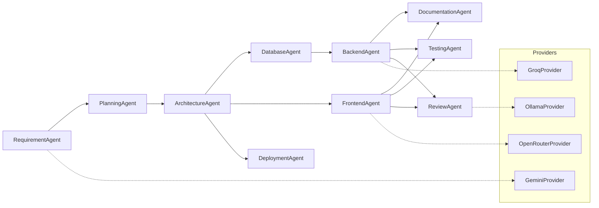
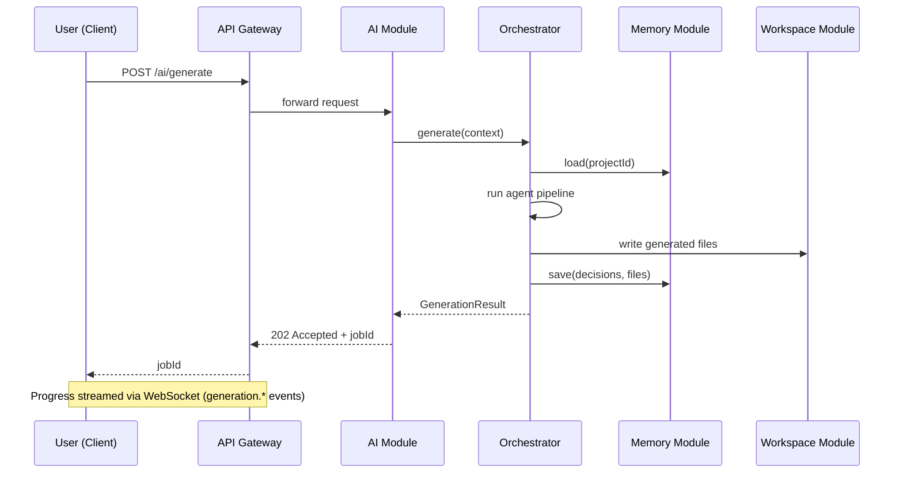

# ForgeMind — Component Architecture

## Table of Contents
1. Purpose
2. Component Inventory
3. Backend Components
4. Frontend Components
5. AI Components
6. Workspace Components
7. Communication Between Components
8. Mermaid Component Diagrams
9. Implementation Notes
10. Future Considerations

---

## 1. Purpose
This document decomposes ForgeMind into discrete, independently testable components, building on the system architecture in `02-architecture.md` and the agent roster in `07-ai-orchestration.md`. It is the canonical map referenced by `21-backend-architecture.md`, `18-components.md`, and `26-agent-design.md`.

A **component** here is a unit with a single responsibility, a stable interface, and explicit dependencies — whether a Spring Boot module, a React component group, an AI agent, or a workspace subsystem.

---

## 2. Component Inventory

| Layer | Component | Owning Module |
|---|---|---|
| Client | Shell (Router, Layout, Theme) | `frontend/src/app` |
| Client | Auth UI | `frontend/src/pages/auth` |
| Client | Dashboard | `frontend/src/pages/dashboard` |
| Client | Project Explorer | `frontend/src/pages/projects` |
| Client | Workspace (Editor/Terminal/Chat) | `frontend/src/pages/workspace` |
| Client | Diagram Viewers | `frontend/src/components/diagrams` |
| Gateway | Auth Filter, Rate Limiter, Router | `backend/.../config` |
| Backend | Auth Module | `backend/.../modules/auth` |
| Backend | Project Module | `backend/.../modules/projects` |
| Backend | Workspace Module | `backend/.../modules/workspace` |
| Backend | Memory Module | `backend/.../modules/memory` |
| Backend | Review Module | `backend/.../modules/review` |
| Backend | Deployment Module | `backend/.../modules/deployment` |
| Backend | Templates Module | `backend/.../modules/templates` |
| AI | Orchestrator | `backend/.../modules/ai/orchestrator` |
| AI | Agents (×10) | `backend/.../modules/ai/agents` |
| AI | Provider Adapters | `backend/.../modules/ai/providers` |
| Infra | PostgreSQL, Redis, Local FS | external services |

---

## 3. Backend Components

Each module follows the layered pattern defined in `21-backend-architecture.md`: `controller → service → repository`, with DTOs crossing the controller boundary and entities never leaving the service layer.

| Module | Responsibility | Depends On |
|---|---|---|
| Auth Module | Register, login, JWT issuance/refresh, RBAC | Redis (sessions), PostgreSQL (users) |
| Project Module | CRUD for projects, status transitions, versions | Memory, PostgreSQL |
| Workspace Module | File tree, file CRUD, build trigger, logs | Local FS, Project Module |
| Memory Module | Persist/retrieve project memory (architecture, db, files, decisions) | PostgreSQL (JSONB) |
| AI Generation Module | Accepts generation/chat requests, delegates to Orchestrator | Orchestrator, Memory |
| Review Module | Stores and serves review reports | PostgreSQL |
| Deployment Module | Generates Docker/CI artifacts, tracks deployment status | Workspace |
| Templates Module | Marketplace CRUD, download counters | PostgreSQL |

---

## 4. Frontend Components

Frontend components are grouped by domain (per `06-folder-structure.md`): `ui/`, `layout/`, `project/`, `workspace/`, `ai/`, `diagrams/`. See `18-components.md` for the full reusable-component catalog.

---

## 5. AI Components

Agents are stateless services invoked by the Orchestrator (`07-ai-orchestration.md`); routing to a specific provider is delegated to the AI Router (`28-ai-router.md`).

---

## 6. Workspace Components

| Component | Responsibility |
|---|---|
| File Explorer | Renders file tree from Workspace Module, supports create/rename/delete |
| Monaco Editor | Code editing, syntax highlighting, AI inline-edit triggers (`33-code-editor.md`) |
| Terminal/Logs Panel | Streams build/runtime logs via WebSocket |
| AI Chat Panel | Sends chat messages, renders streamed agent output |
| Build Status | Shows compile/test/deploy status badges |
| Preview Pane | Renders live preview for frontend-generated projects |

---

## 7. Communication Between Components

| From | To | Mechanism | Reference |
|---|---|---|---|
| Client | Gateway | REST (HTTPS) | `04-api-design.md` |
| Client | Gateway | WebSocket | `14-websocket-api.md` |
| Gateway | Modules | In-process method calls | `21-backend-architecture.md` |
| AI Module | Orchestrator | In-process service call | `07-ai-orchestration.md` |
| Orchestrator | Agents | In-process service call | `26-agent-design.md` |
| Agents | Providers | HTTP (provider SDK/REST) | `28-ai-router.md` |
| Any Module | Memory | In-process service call | `08-memory.md` |
| Workspace Module | Local FS | File I/O | `32-file-management.md` |

---

## 8. Mermaid Component Diagrams

### 8.1 End-to-End Generation Flow

---

## 9. Implementation Notes
- Components are registered as Spring `@Service`/`@Component` beans; cross-module calls go through interfaces, never concrete classes, to keep coupling low (see `21-backend-architecture.md`).
- Frontend components follow the container/presentational split: pages own data-fetching (React Query), presentational components stay pure.
- Every new backend module must register itself in the dependency graph documented in §3 before merge.

## 10. Future Considerations
- Extracting AI Module + Orchestrator into a separate deployable service if generation load outpaces the monolith (see `48-roadmap.md`).
- Introducing an internal event bus (e.g., Spring Application Events → Kafka) once agent count exceeds ~20.
