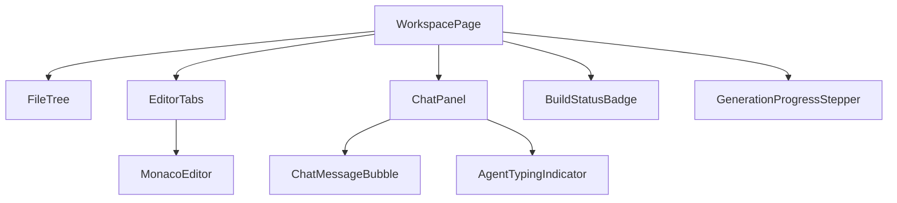

# ForgeMind — Reusable Component Catalog

## Table of Contents
1. Overview
2. Buttons
3. Dialogs
4. Cards
5. Explorer
6. Editor
7. Chat
8. Timeline
9. Progress
10. Tables
11. Forms
12. Charts
13. Notifications
14. Component Composition Example
15. Implementation Notes
16. Future Considerations

---

## 1. Overview
This catalog defines the reusable React components living under `frontend/src/components/` (per `06-folder-structure.md`), built on ShadCN primitives and styled via Tailwind tokens (`19-design-system.md`). Every component listed is intended to be used across multiple pages from `17-pages.md`.

---

## 2. Buttons

| Component | Props (key ones) | Used In |
|---|---|---|
| `Button` | `variant` (primary/secondary/ghost/destructive), `size`, `isLoading` | Everywhere |
| `IconButton` | `icon`, `aria-label` | Toolbars, panel headers |
| `SplitButton` | `primaryAction`, `menuItems` | Workspace "Build ▾" actions |

---

## 3. Dialogs

| Component | Purpose |
|---|---|
| `ConfirmDialog` | Destructive confirmations (delete project, drop table) |
| `Modal` | Generic content modal (base for all others) |
| `CommandPalette` | Cmd+K quick navigation/search across project files and actions |
| `SheetPanel` | Slide-over panel (e.g., file properties, version diff) |

---

## 4. Cards

| Component | Purpose |
|---|---|
| `ProjectCard` | Dashboard project summary (name, status badge, last updated) |
| `StatCard` | Dashboard stats row (Active Projects, AI Usage, etc.) |
| `TemplateCard` | Marketplace template preview |
| `FindingCard` | Review report finding (severity-colored) |

---

## 5. Explorer

| Component | Purpose |
|---|---|
| `FileTree` | Recursive file/folder tree with expand/collapse, drag-to-move |
| `FileTreeNode` | Single row: icon, name, context menu (rename/delete/new) |
| `FileSearchInput` | Fuzzy filter across the open project's file tree |
| `BreadcrumbPath` | Current file path above the editor |

---

## 6. Editor

| Component | Purpose |
|---|---|
| `MonacoEditor` | Wrapped Monaco instance; see `33-code-editor.md` for integration detail |
| `DiffViewer` | Side-by-side/inline diff for AI-proposed changes |
| `EditorTabs` | Open-file tabs with dirty-state indicator |
| `InlineAIEditPrompt` | Floating prompt box for "select code → ask AI to edit" |

---

## 7. Chat

| Component | Purpose |
|---|---|
| `ChatPanel` | Container: message list + input, used in Workspace AI Chat |
| `ChatMessageBubble` | Renders user/agent messages, including streamed partial text |
| `ChatInput` | Multiline input with send-on-enter, attachment support (future) |
| `AgentTypingIndicator` | Shown while `agent.thinking` events are active (`14-websocket-api.md`) |

---

## 8. Timeline

| Component | Purpose |
|---|---|
| `ActivityTimeline` | Dashboard feed of recent generations, edits, deployments |
| `TimelineItem` | Single event row: icon, description, relative timestamp |
| `VersionTimeline` | Project version history (`12-er-diagrams.md` `project_versions`) |

---

## 9. Progress

| Component | Purpose |
|---|---|
| `ProgressBar` | Determinate progress (e.g., file generation count) |
| `GenerationProgressStepper` | Multi-stage indicator (Requirements → Architecture → Backend → ...), driven by `agent.thinking`/`generation.*` events |
| `BuildStatusBadge` | Compact pass/fail/building indicator |

---

## 10. Tables

| Component | Purpose |
|---|---|
| `DataTable` | Generic sortable/paginated table (TanStack Table under the hood) |
| `EndpointTable` | API documentation table (`17-pages.md` ApiPage) |
| `MigrationHistoryTable` | Lists applied migrations (`13-migrations.md`) for advanced users |

---

## 11. Forms

| Component | Purpose |
|---|---|
| `AuthForm` | Login/Register shared form shell |
| `ProjectMetaForm` | Name/description fields (Wizard step 1) |
| `TechStackSelector` | Multi-select tech stack chips (Wizard step 2) |
| `FeatureChecklist` | Feature toggles (Wizard step 3) |
| `FormField` | Label + input + error message wrapper, base for all form inputs |

All forms use `react-hook-form` + a shared `zodResolver` schema set, per `20-state-management.md`.

---

## 12. Charts

| Component | Purpose |
|---|---|
| `UsageChart` | Recharts line/bar chart for AnalyticsPage |
| `ComplexityRadar` | Radar chart of generated project complexity dimensions |
| `ScoreGauge` | Circular gauge for review `score` (0–100) |

---

## 13. Notifications

| Component | Purpose |
|---|---|
| `Toast` | Transient success/error notifications (ShadCN `sonner`-based) |
| `NotificationBell` | Header dropdown for persistent notifications (build complete, review ready) |
| `InlineBanner` | Page-level persistent alert (e.g., "Generation in progress") |

---

## 14. Component Composition Example

---

## 15. Implementation Notes
- Every component accepts a `className` passthrough for Tailwind composition, per ShadCN convention.
- Components are documented and visually catalogued in Storybook (recommended addition, see Future Considerations) once the catalog exceeds ~50 entries.
- No component reaches into global state directly except via explicit hooks (`useProjectStore`, `useChatStore`) — props in, events out.

## 16. Future Considerations
- Introduce Storybook for visual regression testing as the catalog grows past current scope.
- Extract a shared `@forgemind/ui` internal package if a second frontend (e.g., admin panel) is built (`48-roadmap.md`).
