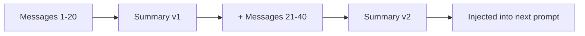
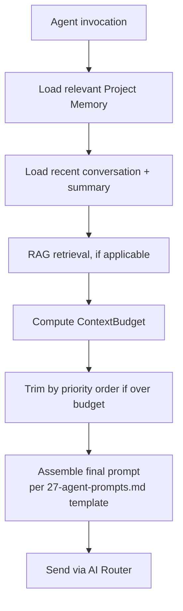

# ForgeMind — Context Management

## Table of Contents
1. Overview
2. Context Types
3. Conversation Memory
4. Project Memory (Structured)
5. Context Compression
6. Summarization Strategy
7. Token Optimization
8. Context Assembly Pipeline
9. Implementation Notes
10. Future Considerations

---

## 1. Overview
Every agent call is bounded by a provider's token limit (`getTokenLimit()`, `28-ai-router.md`). This document defines how ForgeMind decides what context to include, what to compress, and what to drop — sitting between `08-memory.md` (structured memory), `29-rag.md` (semantic retrieval), and the agents themselves.

---

## 2. Context Types

| Type | Source | Lifespan |
|---|---|---|
| Conversation memory | AI Chat message history | Per chat session, summarized over time |
| Project memory | `MemoryService` (`08-memory.md`) | Persistent, versioned |
| Retrieved context | RAG (`29-rag.md`) | Computed per-request |
| Ephemeral task context | Current agent pipeline state (`GenerationContext`) | Single generation run |

---

## 3. Conversation Memory
- Each project has a chat thread (`generations`/chat history); recent messages (default: last 20) are included verbatim.
- Beyond that window, older messages are rolled into a running **conversation summary** (see §6) rather than dropped silently — preserving intent continuity without unbounded growth.

---

## 4. Project Memory (Structured)
- Loaded selectively by `memory_type` relevant to the current agent (e.g., BackendAgent loads `ARCHITECTURE` + `DATABASE` + relevant `FILE` entries, not `DECISION` entries about frontend styling).
- `MemoryService.load(projectId, types[])` is the only sanctioned access path — agents never query `project_memory` directly, keeping the access pattern centralized and cacheable.

---

## 5. Context Compression

| Technique | Applied To | Trigger |
|---|---|---|
| Verbatim inclusion | Small, highly relevant items (current file being edited) | Always, while under budget |
| Summarization | Conversation history beyond the recent-message window | Always for older messages |
| Truncation (head+tail) | Large file contents where only structure matters (e.g., showing imports + class signature, eliding method bodies) | When a single file exceeds ~2K tokens and full body isn't needed |
| Reference-only | Files mentioned but not directly relevant (e.g., "there's also a `UserService`") | When RAG ranks a chunk below the inclusion threshold but it's still worth naming |

---

## 6. Summarization Strategy
- A lightweight summarization pass (using the cheapest/fastest provider, typically Groq per `28-ai-router.md`) condenses conversation history older than the recent-message window into a running summary, re-summarized incrementally (summarize-the-summary, not reprocessing from scratch each time) to bound cost.
- Summaries explicitly preserve: feature requests made, decisions confirmed by the user, and any constraints stated — losing these would cause the system to "forget" prior agreements, which is the primary failure mode this guards against.

---

## 7. Token Optimization

| Strategy | Effect |
|---|---|
| Per-agent context scoping (§4) | Avoids loading irrelevant memory types |
| RAG top-K limiting (`29-rag.md`) | Bounds retrieved-context size |
| Conversation summarization (§6) | Bounds chat-history size |
| Per-file generation (one file per BackendAgent/FrontendAgent call, `26-agent-design.md`) | Avoids needing the entire codebase in one prompt |
| Response caching (`ai:cache:{hash}`, `28-ai-router.md`) | Avoids re-spending tokens on repeated identical prompts |

A `ContextBudget` object is computed per agent call: `providerTokenLimit - reservedOutputTokens - promptOverhead`, and each context type above is allocated a sub-budget, trimmed in priority order (current task > recent conversation > retrieved context > structured memory > summarized history) if the total would exceed the budget.

---

## 8. Context Assembly Pipeline

---

## 9. Implementation Notes
- `ContextBudget` calculations live in a shared `ContextAssembler` component used by all agents, so token-counting logic (provider-specific tokenizer differences) is implemented once.
- Summarization runs as a background step (`25-background-jobs.md`) triggered once a chat thread crosses the recent-message threshold, not synchronously on the critical path of the next chat response.

## 10. Future Considerations
- Sliding-window attention-aware chunking once provider context windows grow large enough that current fixed budgets are overly conservative.
- Per-user configurable verbosity (more/less context included) as an advanced setting, trading cost for thoroughness.
