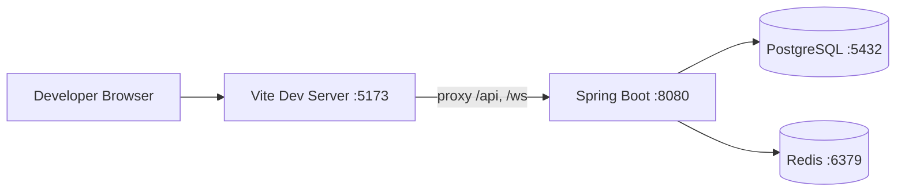
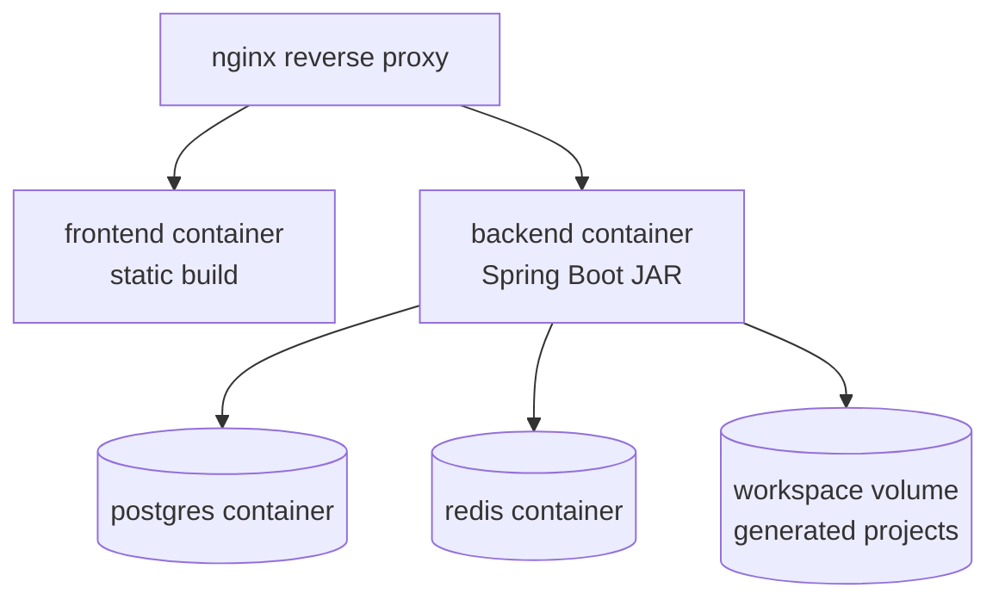
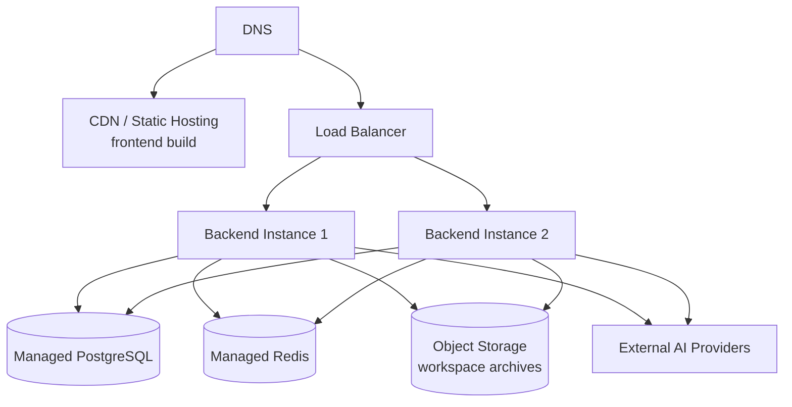
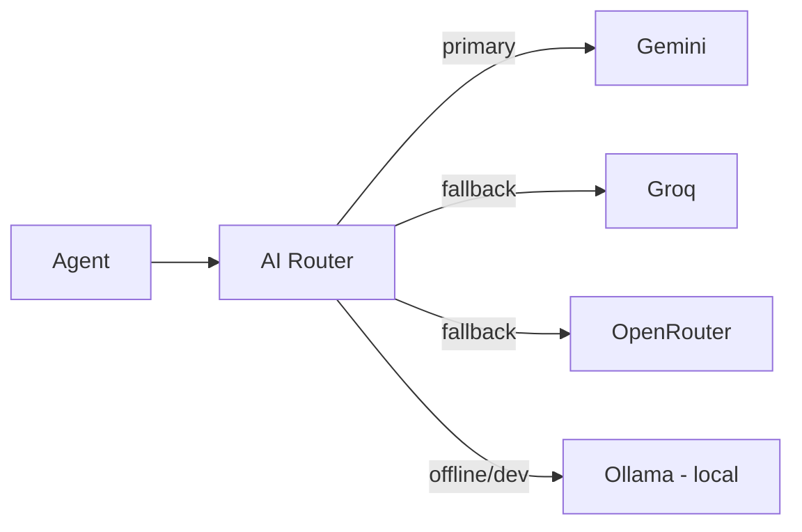
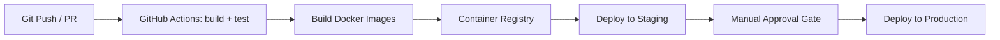
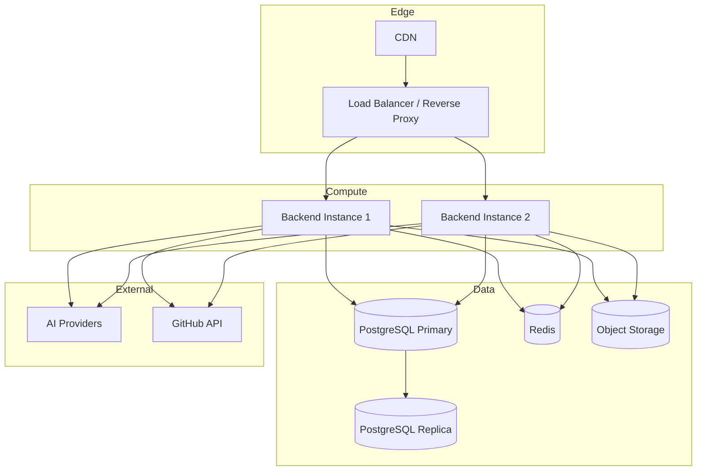

# ForgeMind — Deployment Architecture

## Table of Contents
1. Overview
2. Local Development
3. Docker Deployment
4. Cloud Deployment
5. Reverse Proxy
6. WebSocket Routing
7. Database Deployment
8. Redis Deployment
9. AI Provider Routing
10. CI/CD Architecture
11. Infrastructure Diagram
12. Implementation Notes
13. Future Considerations

---

## 1. Overview
ForgeMind ships as three deployable units — `frontend` (static SPA bundle), `backend` (Spring Boot fat JAR), and supporting infra (PostgreSQL, Redis) — fronted by a reverse proxy. This document defines how those units run locally, in containers, and in the cloud, complementing `39-docker.md`, `40-cicd.md`, and `41-cloud-deployment.md`.

---

## 2. Local Development

| Service | How it runs | Port |
|---|---|---|
| Frontend | `npm run dev` (Vite dev server, HMR) | 5173 |
| Backend | `mvn spring-boot:run` | 8080 |
| PostgreSQL | Local install or Docker container | 5432 |
| Redis | Local install or Docker container | 6379 |

Local `.env` / `application-local.yml` points the frontend's Vite proxy at `localhost:8080` for `/api` and `/ws`, avoiding CORS friction during development.



---

## 3. Docker Deployment

Local/staging environments run via `docker-compose.yml` (full detail in `39-docker.md`):



| Container | Base Image | Notes |
|---|---|---|
| `forgemind-frontend` | `nginx:alpine` serving Vite build output | Static assets only |
| `forgemind-backend` | `eclipse-temurin:21-jre-alpine` | Runs the Spring Boot JAR |
| `forgemind-postgres` | `postgres:16-alpine` | Persistent volume `pgdata` |
| `forgemind-redis` | `redis:7-alpine` | Persistent volume optional (cache-only) |
| `forgemind-proxy` | `nginx:alpine` | Terminates TLS, routes REST/WS/static |

---

## 4. Cloud Deployment

Production topology (expanded in `41-cloud-deployment.md`):



- Frontend build is deployed to a CDN/static host (e.g., Cloudflare Pages, S3+CloudFront, or Nginx behind the LB).
- Backend runs as ≥2 stateless instances behind a load balancer for HA; session state lives in Redis, not in-process, so any instance can serve any request.
- Workspace files are written to object storage (or a shared volume) rather than local disk in multi-instance deployments — see `32-file-management.md`.

---

## 5. Reverse Proxy

Nginx (or equivalent) handles:
- TLS termination
- Routing `/` → frontend static files
- Routing `/api/*` → backend REST
- Routing `/ws` → backend WebSocket (with `Upgrade`/`Connection` headers preserved)
- Gzip/Brotli compression, basic rate limiting at the edge

```nginx
location /api/ {
    proxy_pass http://backend:8080/api/;
}
location /ws {
    proxy_pass http://backend:8080/ws;
    proxy_http_version 1.1;
    proxy_set_header Upgrade $http_upgrade;
    proxy_set_header Connection "upgrade";
}
location / {
    root /usr/share/nginx/html;
    try_files $uri /index.html;
}
```

---

## 6. WebSocket Routing
- Single WebSocket endpoint (`/ws`) multiplexes all event types defined in `14-websocket-api.md`; clients subscribe to topics (e.g., `project/{id}/generation`) using STOMP-style destinations.
- Behind a load balancer, WebSocket connections must be **sticky** (session-affinity) or backed by a shared broker (Redis Pub/Sub) so events fan out across instances.
- Recommended for multi-instance: Spring's `STOMP` over WebSocket with a Redis-backed message broker relay.

---

## 7. Database Deployment

| Environment | Topology |
|---|---|
| Local/Dev | Single PostgreSQL container, no replication |
| Staging | Single managed instance, daily snapshots |
| Production | Managed PostgreSQL (primary + 1 read replica), automated backups (`13-migrations.md`) |

---

## 8. Redis Deployment

| Environment | Topology |
|---|---|
| Local/Dev | Single Redis container, no persistence required |
| Staging | Single managed Redis instance |
| Production | Managed Redis with persistence (AOF) for session durability; used for sessions, AI response cache, rate limiting, and WebSocket fan-out |

---

## 9. AI Provider Routing



Outbound calls to external AI providers go through an egress allow-list; see `28-ai-router.md` for selection, fallback, and cost rules.

---

## 10. CI/CD Architecture



Full pipeline definitions in `40-cicd.md`.

---

## 11. Infrastructure Diagram (Full Production)



---

## 12. Implementation Notes
- All environment-specific config lives in `application-{profile}.yml`; secrets are injected via environment variables (`24-security.md`), never committed.
- Health checks (`/actuator/health`) gate both Docker container restarts and load-balancer routing decisions.

## 13. Future Considerations
- Move to Kubernetes once instance count and operational complexity justify it.
- Multi-region deployment for latency-sensitive AI streaming once user base is geographically distributed.
