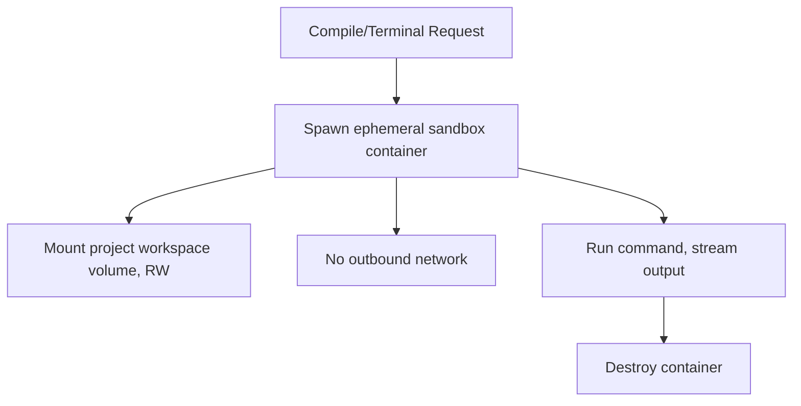

# ForgeMind — Docker Architecture

## Table of Contents
1. Overview
2. Image Strategy
3. Backend Dockerfile Design
4. Frontend Dockerfile Design
5. docker-compose (Local/Staging)
6. Build Sandbox Containers
7. Networking
8. Volumes
9. Implementation Notes
10. Future Considerations

---

## 1. Overview
This document specifies Docker usage for both ForgeMind itself (the platform) and the per-generation **build sandbox** used by Self-Healing (`36-self-healing.md`) and the Workspace Terminal (`31-workspace.md`). It expands `10-deployment-architecture.md` §3.

---

## 2. Image Strategy

| Image | Purpose | Build Strategy |
|---|---|---|
| `forgemind-backend` | Platform backend | Multi-stage: Maven build stage → slim JRE runtime stage |
| `forgemind-frontend` | Platform frontend | Multi-stage: Node build stage → nginx static-serve stage |
| `forgemind-sandbox-java` | Build sandbox for generated Java/Spring projects | Pinned JDK + Maven, no platform code, ephemeral per build |
| `forgemind-sandbox-node` | Build sandbox for generated React/Node projects | Pinned Node + npm, ephemeral per build |

Sandbox images are intentionally minimal and contain **no ForgeMind platform code or secrets** — they only compile/run the generated project's own code, isolating any AI-generated code execution from the platform itself.

---

## 3. Backend Dockerfile Design

```dockerfile
# Stage 1: build
FROM maven:3.9-eclipse-temurin-21 AS build
WORKDIR /app
COPY pom.xml .
RUN mvn dependency:go-offline
COPY src ./src
RUN mvn package -DskipTests

# Stage 2: runtime
FROM eclipse-temurin:21-jre-alpine
WORKDIR /app
COPY --from=build /app/target/*.jar app.jar
EXPOSE 8080
ENTRYPOINT ["java", "-jar", "app.jar"]
```

Multi-stage build keeps the final image to a JRE + JAR only — no Maven, no source tree, reducing image size and attack surface.

---

## 4. Frontend Dockerfile Design

```dockerfile
# Stage 1: build
FROM node:20-alpine AS build
WORKDIR /app
COPY package*.json ./
RUN npm ci
COPY . .
RUN npm run build

# Stage 2: serve
FROM nginx:alpine
COPY --from=build /app/dist /usr/share/nginx/html
COPY nginx.conf /etc/nginx/conf.d/default.conf
EXPOSE 80
```

---

## 5. docker-compose (Local/Staging)

```yaml
services:
  proxy:
    image: nginx:alpine
    ports: ["443:443", "80:80"]
    depends_on: [frontend, backend]

  frontend:
    build: ./frontend
    expose: ["80"]

  backend:
    build: ./backend
    expose: ["8080"]
    environment:
      - SPRING_PROFILES_ACTIVE=staging
      - DB_URL=jdbc:postgresql://postgres:5432/forgemind
      - REDIS_HOST=redis
    depends_on: [postgres, redis]
    volumes:
      - workspace-data:/var/forgemind/workspaces

  postgres:
    image: postgres:16-alpine
    environment:
      - POSTGRES_DB=forgemind
    volumes:
      - pgdata:/var/lib/postgresql/data

  redis:
    image: redis:7-alpine

volumes:
  pgdata:
  workspace-data:
```

---

## 6. Build Sandbox Containers
- Each Self-Healing compile check (`36-self-healing.md`) or Terminal command (`31-workspace.md`) spins up a short-lived sandbox container, scoped to a single project's workspace volume mounted **read-write but network-isolated** (no outbound internet access from the sandbox, preventing generated/executed code from making arbitrary network calls).
- Sandbox containers are destroyed immediately after the command completes — no persistent sandbox container per project, to avoid resource buildup with many concurrent users.
- Resource limits (CPU/memory) are enforced per sandbox container to prevent a single project's build from starving the host (`cpus: "1.0"`, `mem_limit: 512m` as defaults, tunable).



---

## 7. Networking
- Platform containers (`backend`, `frontend`, `postgres`, `redis`) share a private Docker network; only `proxy` is exposed externally (`10-deployment-architecture.md`).
- Sandbox containers join an isolated network with **no** route to the platform network or external internet — they can only access the mounted workspace volume.

---

## 8. Volumes
| Volume | Mounted By | Purpose |
|---|---|---|
| `pgdata` | `postgres` | Database persistence |
| `workspace-data` | `backend`, sandbox containers | Generated project files (`LocalFileStorageAdapter`, `32-file-management.md`) |

In cloud/multi-instance deployments, `workspace-data` is replaced by the `S3FileStorageAdapter` and sandbox containers receive a per-build temporary download/upload of the relevant files rather than a shared mount (`10-deployment-architecture.md` §4).

---

## 9. Implementation Notes
- All platform images are scanned for vulnerabilities in CI (`40-cicd.md`) before push to the registry.
- Sandbox image versions are pinned exactly (no `latest` tags) and updated deliberately, since an unexpected toolchain version bump could silently change compile behavior for all in-flight generations.

## 10. Future Considerations
- Migrate sandbox orchestration to a dedicated lightweight runtime (e.g., gVisor or Firecracker microVMs) for stronger isolation guarantees if untrusted-code-execution risk grows with platform scale.
