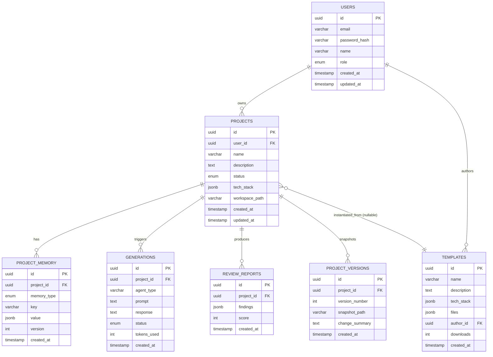

# ForgeMind — Entity-Relationship Diagrams

## Table of Contents
1. Overview
2. Complete ER Diagram
3. Entity Detail & Constraints
4. Relationships & Cardinality
5. Index Recommendations
6. Implementation Notes
7. Future Considerations

---

## 1. Overview
This document formalizes the relational model implied by `03-database.md` into a full ER diagram with explicit cardinality, constraints, and indexing guidance. It is the source of truth consumed by `13-migrations.md`.

---

## 2. Complete ER Diagram

> Note: `PROJECT_VERSIONS` extends `03-database.md` to make the "Version History" feature (`01-requirements.md`) and `/projects/{id}/versions` endpoint (`04-api-design.md`) concrete; it does not contradict the existing schema, it specifies the table referenced by that endpoint.

---

## 3. Entity Detail & Constraints

### users
| Constraint | Detail |
|---|---|
| PK | `id` |
| UNIQUE | `email` |
| CHECK | `role IN ('USER','ADMIN')` |
| NOT NULL | `email`, `password_hash`, `role`, `created_at` |

### projects
| Constraint | Detail |
|---|---|
| PK | `id` |
| FK | `user_id → users.id` ON DELETE CASCADE |
| CHECK | `status IN ('DRAFT','GENERATING','READY','DEPLOYED')` |
| NOT NULL | `name`, `user_id`, `status` |

### project_memory
| Constraint | Detail |
|---|---|
| PK | `id` |
| FK | `project_id → projects.id` ON DELETE CASCADE |
| CHECK | `memory_type IN ('ARCHITECTURE','DATABASE','MODULE','FILE','DECISION')` |
| UNIQUE | `(project_id, memory_type, key, version)` |

### generations
| Constraint | Detail |
|---|---|
| PK | `id` |
| FK | `project_id → projects.id` ON DELETE CASCADE |
| CHECK | `status IN ('PENDING','SUCCESS','FAILED')` |
| NOT NULL | `agent_type`, `prompt`, `status` |

### review_reports
| Constraint | Detail |
|---|---|
| PK | `id` |
| FK | `project_id → projects.id` ON DELETE CASCADE |
| CHECK | `score BETWEEN 0 AND 100` |

### project_versions
| Constraint | Detail |
|---|---|
| PK | `id` |
| FK | `project_id → projects.id` ON DELETE CASCADE |
| UNIQUE | `(project_id, version_number)` |

### templates
| Constraint | Detail |
|---|---|
| PK | `id` |
| FK | `author_id → users.id` ON DELETE SET NULL |
| NOT NULL | `name`, `tech_stack`, `files` |
| DEFAULT | `downloads = 0` |

---

## 4. Relationships & Cardinality

| Relationship | Cardinality | Delete Rule |
|---|---|---|
| users → projects | 1 : N | CASCADE |
| users → templates (as author) | 1 : N | SET NULL |
| projects → project_memory | 1 : N | CASCADE |
| projects → generations | 1 : N | CASCADE |
| projects → review_reports | 1 : N | CASCADE |
| projects → project_versions | 1 : N | CASCADE |
| templates → projects | 1 : N (optional, nullable FK) | SET NULL |

---

## 5. Index Recommendations

| Table | Index | Purpose |
|---|---|---|
| users | UNIQUE btree on `email` | Login lookups |
| projects | btree on `user_id` | List user's projects |
| projects | btree on `status` | Dashboard filtering |
| project_memory | btree on `(project_id, memory_type)` | Memory load by type |
| project_memory | GIN on `value` (jsonb) | Querying memory contents |
| generations | btree on `(project_id, created_at DESC)` | Recent generations feed |
| review_reports | btree on `project_id` | Latest report lookup |
| project_versions | btree on `(project_id, version_number DESC)` | Version history listing |
| templates | btree on `downloads DESC` | Marketplace sorting |
| templates | GIN on `tech_stack` (jsonb) | Tech-stack filter search |

---

## 6. Implementation Notes
- All JSONB columns use PostgreSQL GIN indexes only where query patterns justify it (avoid indexing every JSONB column by default — see write-amplification note in `13-migrations.md`).
- Foreign keys are declared with explicit `ON DELETE` rules; application code must not rely on orphaned-row cleanup jobs for these cases.
- `version` columns (`project_memory.version`, `project_versions.version_number`) are monotonically increasing integers managed by the Memory Module, not auto-increment sequences, so they can be assigned transactionally alongside the JSONB payload.

## 7. Future Considerations
- Partition `generations` by month once row count passes ~10M (`48-roadmap.md`).
- Consider a dedicated `audit_logs` table (see `24-security.md`) with its own ER subgraph once compliance requirements solidify.
