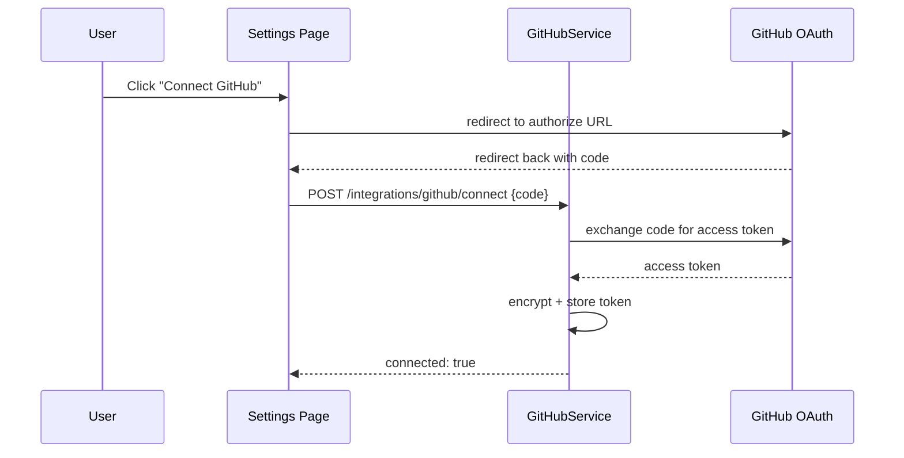
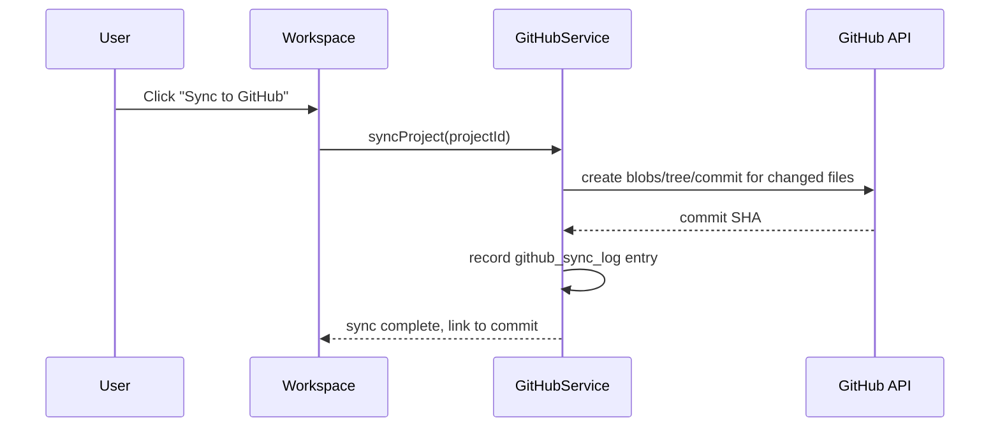

# ForgeMind — GitHub Integration

## Table of Contents
1. Overview
2. OAuth Connection
3. Repository Creation
4. Commits
5. Branches
6. Pull Requests
7. Version History Sync
8. Sequence Diagram
9. Implementation Notes
10. Future Considerations

---

## 1. Overview
GitHub integration lets users push a generated project to a real repository, enabling normal Git-based workflows outside ForgeMind. This lives in the `github` module (`23-package-structure.md`), surfaced in `SettingsPage` (`17-pages.md`).

---

## 2. OAuth Connection
- Standard OAuth 2.0 Authorization Code flow against GitHub.
- Requested scopes: `repo` (create/push to repositories on the user's behalf) — no broader scopes (e.g., `admin:org`) requested.
- Access token (and refresh token, if GitHub App installation is used instead of OAuth App) is stored encrypted server-side, associated with the `users` row, never exposed to the client (`24-security.md`).
- Connection status and a "Disconnect" action are shown in `SettingsPage`'s `GitHubConnectionCard` (`18-components.md`).

---

## 3. Repository Creation
- `POST /api/v1/projects/{id}/github/create-repo` creates a new GitHub repository (public/private, user-selected) via the GitHub REST API, named after the project by default (editable).
- Initial push includes the full current workspace state as the first commit, with a generated `.gitignore` appropriate to the project's tech stack (`11-tech-stack.md`).

---

## 4. Commits
- Every subsequent surgical edit or full regeneration **optionally** triggers an auto-commit (user preference, default: off — manual "Sync to GitHub" action is the default to avoid commit-spam from rapid AI iterations).
- Auto-commit messages are generated by `DocumentationAgent` (`26-agent-design.md`) summarizing the change, mirroring the `change_summary` already produced for `project_versions` (`32-file-management.md`) — the same summary is reused for both, avoiding duplicate generation work.
- Commits are attributed to the connected GitHub user (not a generic "ForgeMind bot" identity), since the user authorized the integration with their own credentials.

---

## 5. Branches
- Default behavior: all syncs go to the repository's default branch (`main`).
- Optional "Generate on a branch" mode (for users who want to review AI changes via PR before merging): ForgeMind creates a feature branch (e.g., `forgemind/wishlist-feature`) per significant surgical edit.

---

## 6. Pull Requests
- When branch mode (§5) is enabled, ForgeMind opens a PR from the feature branch into the default branch automatically, with a PR description generated from the `EditPlan` (`35-project-editing.md`) and the `ReviewReport` (`37-code-review.md`) findings for the changed files — giving reviewers AI-generated context plus AI-generated quality findings in one place.
- PR creation uses the GitHub REST API (`POST /repos/{owner}/{repo}/pulls`); ForgeMind does not auto-merge — merging remains a manual user/team decision.

---

## 7. Version History Sync
- ForgeMind's own `project_versions` (`32-file-management.md`) and GitHub's commit history are **not** forced into 1:1 correspondence — a user may make several surgical edits (each a ForgeMind version) before choosing to sync, resulting in one GitHub commit covering multiple ForgeMind versions, or vice versa. This is intentional: GitHub sync is a deliberate user action, not a mirror of every internal generation step.
- The mapping between a GitHub commit SHA and the ForgeMind version(s) it represents is recorded for traceability (`github_sync_log`, extending `12-er-diagrams.md`).

---

## 8. Sequence Diagram

---

## 9. Implementation Notes
- All GitHub API calls go through a single `GitHubApiClient` (`23-package-structure.md`) with built-in rate-limit awareness (GitHub's own API rate limits, distinct from ForgeMind's internal rate limiting, `24-security.md`).
- Token refresh/expiry is handled transparently; an expired/revoked connection surfaces as a clear "reconnect GitHub" prompt rather than a silent failure.

## 10. Future Considerations
- GitLab/Bitbucket support following the same `GitHubApiClient`-style abstraction, generalized into a `GitProvider` interface.
- Two-way sync (pulling manual commits made outside ForgeMind back into the Workspace) once conflict-resolution UX is designed.
