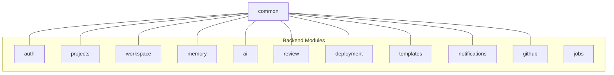

# ForgeMind — Enterprise Package Structure

## Table of Contents
1. Overview
2. Full Backend Package Tree
3. Full Frontend Package Tree
4. Package Naming Conventions
5. Module Boundary Diagram
6. Implementation Notes
7. Future Considerations

---

## 1. Overview
This document expands `06-folder-structure.md` into the full enterprise-scale package layout expected once the backend and frontend each contain hundreds of classes/components. It is the canonical reference for "where does this new class go?"

---

## 2. Full Backend Package Tree

```
backend/src/main/java/com/forgemind/
├── ForgemindApplication.java
├── config/
│   ├── SecurityConfig.java
│   ├── WebSocketConfig.java
│   ├── CorsConfig.java
│   ├── JacksonConfig.java
│   ├── RedisConfig.java
│   └── OpenApiConfig.java
├── common/
│   ├── dto/                  PageResponse, ErrorResponse, etc.
│   ├── exception/             ForgemindException + subtypes, GlobalExceptionHandler
│   ├── util/                  Mappers, date/string utils
│   └── annotation/            Custom validation annotations
├── modules/
│   ├── auth/
│   │   ├── controller/AuthController.java
│   │   ├── service/AuthService.java, AuthServiceImpl.java
│   │   ├── repository/UserRepository.java
│   │   ├── domain/User.java, Role.java
│   │   ├── dto/RegisterRequest.java, LoginRequest.java, AuthResponse.java
│   │   ├── security/JwtUtil.java, JwtAuthFilter.java
│   │   └── exception/InvalidCredentialsException.java
│   ├── projects/
│   │   ├── controller/ProjectController.java
│   │   ├── service/ProjectService.java, ProjectServiceImpl.java
│   │   ├── repository/ProjectRepository.java, ProjectVersionRepository.java
│   │   ├── domain/Project.java, ProjectStatus.java, ProjectVersion.java
│   │   ├── dto/CreateProjectRequest.java, ProjectResponse.java
│   │   └── exception/ProjectNotFoundException.java
│   ├── workspace/
│   │   ├── controller/WorkspaceController.java
│   │   ├── service/WorkspaceService.java, BuildRunner.java
│   │   ├── repository/ (none — FS-backed, see FileStorageAdapter)
│   │   ├── storage/FileStorageAdapter.java, LocalFileStorageAdapter.java, S3FileStorageAdapter.java
│   │   └── dto/FileTreeResponse.java, FileContentResponse.java
│   ├── memory/
│   │   ├── controller/MemoryController.java
│   │   ├── service/MemoryService.java
│   │   ├── repository/ProjectMemoryRepository.java
│   │   ├── domain/ProjectMemory.java, MemoryType.java
│   │   └── dto/MemorySnapshot.java
│   ├── ai/
│   │   ├── controller/AIController.java
│   │   ├── orchestrator/AgentOrchestrator.java, GenerationContext.java
│   │   ├── agents/
│   │   │   ├── RequirementAgent.java
│   │   │   ├── PlanningAgent.java
│   │   │   ├── ArchitectureAgent.java
│   │   │   ├── DatabaseAgent.java
│   │   │   ├── BackendAgent.java
│   │   │   ├── FrontendAgent.java
│   │   │   ├── DocumentationAgent.java
│   │   │   ├── TestingAgent.java
│   │   │   ├── ReviewAgent.java
│   │   │   └── DeploymentAgent.java
│   │   ├── providers/
│   │   │   ├── AIProvider.java (interface)
│   │   │   ├── GeminiProvider.java
│   │   │   ├── GroqProvider.java
│   │   │   ├── OpenRouterProvider.java
│   │   │   └── OllamaProvider.java
│   │   ├── router/AIRouter.java, RoutingPolicy.java
│   │   ├── rag/VectorStoreClient.java, EmbeddingService.java, Retriever.java
│   │   ├── service/AIGenerationService.java
│   │   └── dto/GenerationRequest.java, ChatRequest.java, GenerationStatusResponse.java
│   ├── review/
│   │   ├── controller/ReviewController.java
│   │   ├── service/ReviewService.java
│   │   ├── repository/ReviewReportRepository.java
│   │   └── domain/ReviewReport.java
│   ├── deployment/
│   │   ├── controller/DeploymentController.java
│   │   ├── service/DeploymentService.java
│   │   └── dto/DeploymentArtifactResponse.java
│   ├── templates/
│   │   ├── controller/TemplateController.java
│   │   ├── service/TemplateService.java
│   │   ├── repository/TemplateRepository.java
│   │   └── domain/Template.java
│   ├── notifications/
│   │   ├── service/NotificationService.java
│   │   ├── repository/NotificationRepository.java
│   │   └── domain/Notification.java
│   ├── github/
│   │   ├── controller/GitHubIntegrationController.java
│   │   ├── service/GitHubService.java
│   │   └── client/GitHubApiClient.java
│   └── jobs/
│       ├── ScheduledCleanupJob.java
│       ├── RetryFailedGenerationJob.java
│       └── config/JobSchedulerConfig.java
└── websocket/
    ├── WebSocketEventRelay.java
    └── topic/GenerationTopic.java, ChatTopic.java
```

---

## 3. Full Frontend Package Tree

```
frontend/src/
├── app/                       Router setup, RootLayout, providers
├── components/
│   ├── ui/                    ShadCN primitives (button, dialog, input, ...)
│   ├── layout/                Navbar, Sidebar, AppLayout, WorkspaceLayout
│   ├── project/                ProjectCard, ProjectHeader, StatusBadge
│   ├── workspace/
│   │   ├── explorer/          FileTree, FileTreeNode, FileSearchInput
│   │   ├── editor/             MonacoEditor, DiffViewer, EditorTabs
│   │   ├── terminal/           TerminalPanel, LogLine
│   │   └── chat/               ChatPanel, ChatMessageBubble, ChatInput
│   ├── diagrams/                MermaidDiagramViewer, ERDiagramViewer
│   ├── charts/                  UsageChart, ComplexityRadar, ScoreGauge
│   ├── forms/                   AuthForm, ProjectMetaForm, TechStackSelector
│   └── feedback/                 Toast, InlineBanner, ConfirmDialog
├── pages/
│   ├── LandingPage.tsx
│   ├── auth/ LoginPage.tsx, RegisterPage.tsx
│   ├── dashboard/ DashboardPage.tsx
│   ├── projects/ ProjectWizard.tsx, ProjectExplorer.tsx, ArchitecturePage.tsx, DatabasePage.tsx, ApiPage.tsx
│   ├── workspace/ WorkspacePage.tsx
│   ├── settings/ SettingsPage.tsx
│   └── analytics/ AnalyticsPage.tsx
├── hooks/
│   ├── useProjects.ts, useProject.ts, useWorkspaceFiles.ts
│   ├── useWebSocketBridge.ts
│   └── useGenerationProgress.ts
├── store/
│   ├── useAuthStore.ts, useWizardStore.ts
│   ├── useWorkspaceStore.ts, useChatStore.ts, useStreamStore.ts
├── api/
│   ├── client.ts               Axios/fetch instance, interceptors
│   ├── auth.api.ts, projects.api.ts, workspace.api.ts, ai.api.ts
├── types/
│   ├── project.types.ts, workspace.types.ts, ai.types.ts
├── utils/
│   ├── formatters.ts, validators.ts
└── styles/
    └── tokens.css
```

---

## 4. Package Naming Conventions

| Element | Convention | Example |
|---|---|---|
| Backend package | lowercase, singular feature noun | `modules.projects`, not `modules.Projects` |
| Java class | PascalCase, suffix indicates role | `ProjectService`, `ProjectController`, `ProjectRepository` |
| DTO | Suffixed `Request`/`Response` | `CreateProjectRequest`, `ProjectResponse` |
| Frontend folder | kebab-case or lowercase | `workspace/editor` |
| React component file | PascalCase matching component name | `FileTree.tsx` |
| Hook file | camelCase, `use` prefix | `useWorkspaceFiles.ts` |
| Zustand store file | camelCase, `use...Store` suffix | `useWorkspaceStore.ts` |

---

## 5. Module Boundary Diagram



`common` has no outgoing dependencies on any module (enforced via ArchUnit, `21-backend-architecture.md`); every module may depend on `common`.

---

## 6. Implementation Notes
- New backend modules are scaffolded with the same five sub-packages (`controller/service/repository/domain/dto`) even if a sub-package starts empty, to keep the structure predictable.
- Frontend feature folders mirror backend module names where there's a 1:1 relationship (`workspace` ↔ `workspace`), easing cross-referencing during development.

## 7. Future Considerations
- If `ai/` grows beyond ~30 agent classes, consider splitting `agents/` into `agents/planning/`, `agents/generation/`, `agents/quality/` sub-groupings.
- Revisit this structure if any module is extracted into a separate Maven module/microservice (`48-roadmap.md`).
