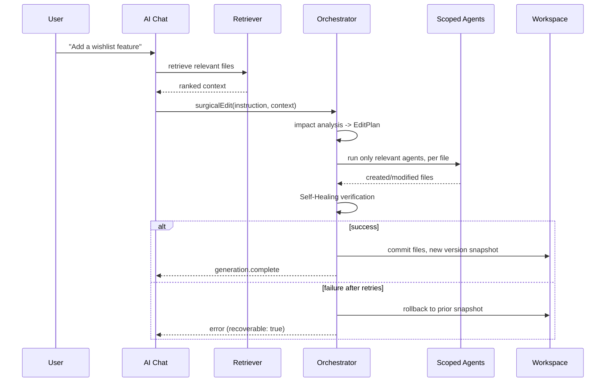

# ForgeMind — Incremental Project Editing

## Table of Contents
1. Overview
2. Surgical Edit vs. Full Regeneration
3. Edit Request Flow
4. Impact Analysis
5. Scoped Regeneration
6. Consistency Guarantees
7. Sequence Diagram
8. Implementation Notes
9. Future Considerations

---

## 1. Overview
After initial generation (`34-project-generation.md`), most user requests are **incremental**: "add a wishlist feature," "rename this field," "make this endpoint paginated." This document defines how ForgeMind edits an existing generated project without regenerating everything — the mechanism referred to as "surgical edits" in `08-memory.md`.

---

## 2. Surgical Edit vs. Full Regeneration

| Aspect | Surgical Edit | Full Regeneration |
|---|---|---|
| Trigger | AI Chat message on an existing `READY`/`DEPLOYED` project | Explicit "regenerate from scratch" action (rare, destructive) |
| Scope | Only affected files | Entire project |
| Pipeline used | Impact analysis + scoped agent calls (this document) | Full pipeline (`34-project-generation.md`) |
| Memory usage | Reads existing memory, writes deltas | Memory is reset and rebuilt |

ForgeMind defaults to surgical edits for all post-generation requests; full regeneration requires explicit, confirmed user intent (destructive action warning in the UI).

---

## 3. Edit Request Flow
1. User describes the change in AI Chat (`31-workspace.md`).
2. RAG (`29-rag.md`) retrieves the files most semantically relevant to the request.
3. Impact analysis (§4) determines which files must change, which are merely referenced, and whether the database schema is affected.
4. Scoped regeneration (§5) runs only the necessary agents against only the affected files.
5. Self-Healing (`36-self-healing.md`) verifies the result compiles before presenting it.
6. A new `project_versions` snapshot is created (`32-file-management.md`), with a `change_summary` describing the edit.

---

## 4. Impact Analysis

| Signal | Used To Determine |
|---|---|
| RAG top-K files | Candidate files likely needing changes |
| `project_memory` `FILE` entries' `dependencies` field (`08-memory.md`) | Downstream files that reference a changed file (e.g., a new entity field requires updating its DTO, service, and any frontend form) |
| `DatabaseSchema` diff (if the request implies a schema change) | Whether a new migration is required |
| Architecture module boundaries | Whether the change is contained within one module or crosses boundaries (cross-module changes get extra review scrutiny) |

Impact analysis produces an `EditPlan`:
```json
{
  "filesToCreate": ["backend/.../WishlistController.java", "..."],
  "filesToModify": ["backend/.../ProductService.java"],
  "filesToReview": ["frontend/.../ProductPage.tsx"],
  "schemaChange": true,
  "migrationRequired": true
}
```

---

## 5. Scoped Regeneration
- Only agents relevant to the `EditPlan` run: a frontend-only request never invokes DatabaseAgent; a schema-changing request invokes DatabaseAgent first, then cascades to BackendAgent for affected files, then FrontendAgent only for files in `filesToModify`/`filesToCreate` that touch the changed API surface.
- Each file in `filesToModify` is regenerated with its **current content** included as context (not regenerated from nothing), instructed to make the minimal change satisfying the request — this is what keeps edits "surgical" rather than producing a wholesale rewrite of an existing file.
- Files in `filesToReview` are not regenerated automatically; they're flagged in the resulting `ReviewReport` (`37-code-review.md`) as "may need manual follow-up" if the Orchestrator's confidence in the impact analysis is below a threshold.

---

## 6. Consistency Guarantees
- A surgical edit either fully succeeds (all planned files updated, Self-Healing verified) or fully rolls back to the pre-edit version snapshot — never left in a half-applied state visible to the user.
- `MemoryService` updates (`FILE`, `DECISION` entries) are written transactionally alongside the workspace file writes within the same edit operation.

---

## 7. Sequence Diagram



---

## 8. Implementation Notes
- The `EditPlan` is itself persisted as a `DECISION` memory entry, giving future surgical edits visibility into past edit rationale — useful when a later request conflicts with an earlier one.
- Cross-module edits (touching both backend and frontend) are still a single atomic edit operation from the user's perspective, even though internally multiple agents run sequentially.

## 9. Future Considerations
- Confidence scoring on `EditPlan` accuracy, with a user-facing "review affected files before applying" step for low-confidence plans, as an opt-in safety setting.
- Multi-turn edit planning (breaking a large request into a sequence of smaller surgical edits, confirmed step by step) for complex feature requests.
