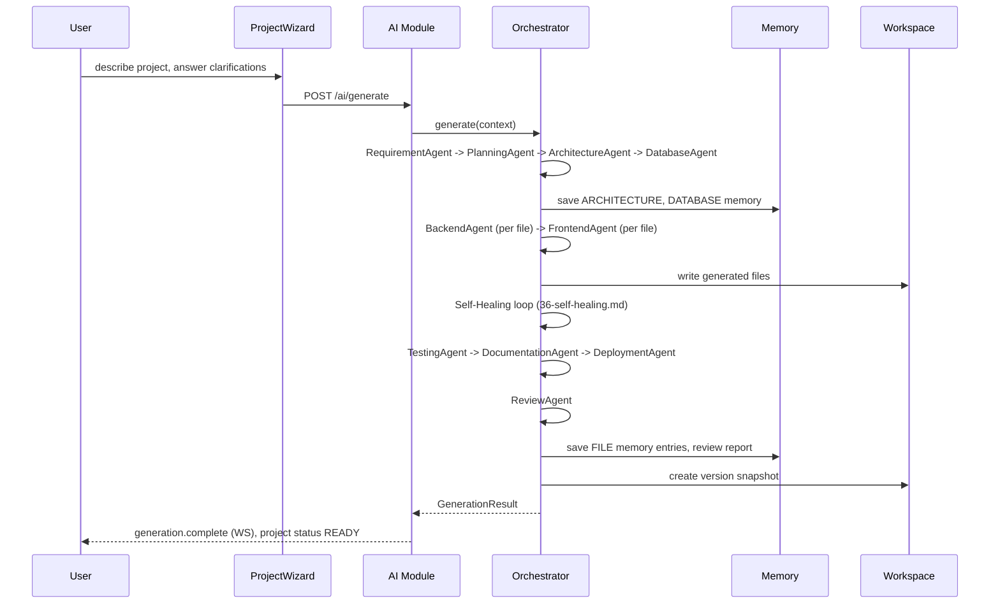

# ForgeMind — Project Generation Pipeline

## Table of Contents
1. Overview
2. Pipeline Stages
3. End-to-End Flow Diagram
4. Stage Detail
5. Partial Failure Handling
6. Output: Downloadable Project
7. Implementation Notes
8. Future Considerations

---

## 1. Overview
This document traces the complete path from a user's initial prompt to a downloadable, working project — tying together the Orchestrator (`07-ai-orchestration.md`), all ten agents (`26-agent-design.md`), Memory (`08-memory.md`), Workspace storage (`32-file-management.md`), and Self-Healing (`36-self-healing.md`).

---

## 2. Pipeline Stages

| # | Stage | Agent | Output |
|---|---|---|---|
| 1 | Requirement gathering | RequirementAgent | `StructuredRequirements` |
| 2 | Planning | PlanningAgent | `ProjectPlan` |
| 3 | Architecture design | ArchitectureAgent | `ArchitectureDesign` |
| 4 | Database design | DatabaseAgent | `DatabaseSchema` + migration SQL |
| 5 | Backend generation | BackendAgent | Backend file set |
| 6 | Frontend generation | FrontendAgent | Frontend file set |
| 7 | Self-healing | (compile/fix loop) | Verified-compiling file set |
| 8 | Test generation | TestingAgent | Test file set |
| 9 | Documentation generation | DocumentationAgent | README/API docs |
| 10 | Deployment artifacts | DeploymentAgent | Dockerfile/CI workflow |
| 11 | Review | ReviewAgent | `ReviewReport` |
| 12 | Finalization | Orchestrator | Project marked `READY`, version snapshot created |

---

## 3. End-to-End Flow Diagram

---

## 4. Stage Detail

### Stages 1–4 (Planning Phase)
Run sequentially, each feeding the next's input — no parallelism, since each stage's output is a hard dependency for the next (per `26-agent-design.md`'s critical-agent designation).

### Stages 5–6 (Code Generation Phase)
- BackendAgent and FrontendAgent run **per-file**, and files within a stage that have no interdependency are generated with bounded parallelism (default concurrency: 4) to reduce wall-clock time, respecting the AI Router's provider rate limits (`28-ai-router.md`).
- File generation order follows a dependency-aware topological sort (e.g., entities before repositories before services before controllers) computed from `ArchitectureDesign.modules` and `DatabaseSchema.tables`.

### Stage 7 (Self-Healing)
Runs after each generation batch (backend, then frontend) — see `36-self-healing.md` for the full compile/detect/fix loop.

### Stages 8–10 (Quality & Packaging Phase)
Run with relative independence; TestingAgent, DocumentationAgent, and DeploymentAgent can execute concurrently since none depends on the others' output (only on the now-stable backend/frontend file set).

### Stage 11 (Review)
Runs last, against the complete, self-healed, tested file set — reviewing partially-generated code would produce noisy/irrelevant findings.

### Stage 12 (Finalization)
- Project status transitions `GENERATING → READY` only after Review completes (even if Review finds issues — issues are surfaced, not blocking, per `26-agent-design.md`'s graceful-degradation rule for non-critical agents).
- A `project_versions` snapshot (`32-file-management.md`) is created representing "initial generation," establishing the baseline for future surgical edits (`35-project-editing.md`).

---

## 5. Partial Failure Handling

| Failure Point | Behavior |
|---|---|
| Stages 1–4 (critical) fail after retries | Abort, project stays `DRAFT`, user notified with the specific failure reason |
| Stage 5/6 fails for an individual file after Self-Healing exhausts attempts | That file is flagged in the Review report as `CRITICAL`, generation continues for other files, project still reaches `READY` (degraded) |
| Stage 8/9/10 fails | Logged, skipped, generation continues (non-critical, `26-agent-design.md`) |
| Stage 11 fails entirely | Project still reaches `READY` with no review report; a manual "re-run review" option is shown |

---

## 6. Output: Downloadable Project
Once `READY`, the project is downloadable in full via `GET /api/v1/workspace/{id}/download` (`32-file-management.md`) and is immediately usable in the Workspace for further surgical edits (`35-project-editing.md`) — generation and editing produce the same artifact shape, there is no separate "export format."

---

## 7. Implementation Notes
- The entire pipeline executes within a single logical `jobId`; all WebSocket events (`14-websocket-api.md`) and memory writes are tagged with `jobId` for traceability.
- Pipeline stage transitions are themselves recorded as `generations` rows (`03-database.md`) for auditability and to power the `GenerationProgressStepper` UI (`18-components.md`).

## 8. Future Considerations
- User-configurable pipeline (e.g., skip TestingAgent for faster iteration) as a power-user setting.
- Parallelizing Stages 5/6 against each other (rather than sequentially) once the dependency analysis is robust enough to safely interleave backend and frontend generation.
