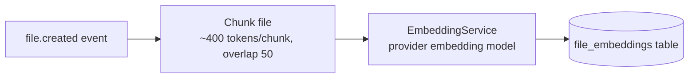
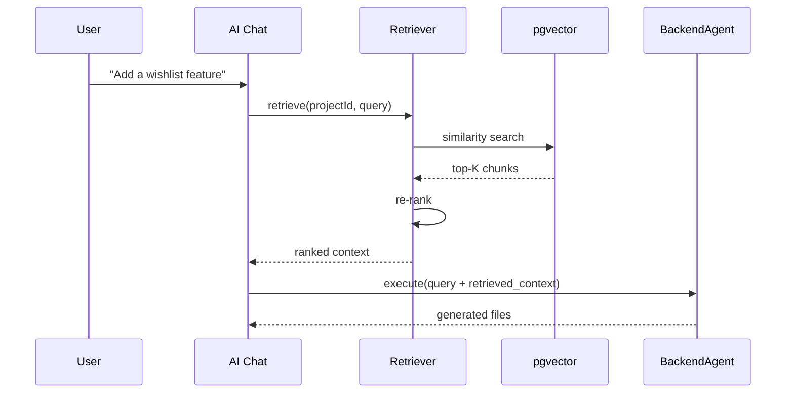

# ForgeMind — Retrieval-Augmented Generation (RAG)

## Table of Contents
1. Overview
2. When RAG Is Used
3. Vector Storage
4. Embedding Pipeline
5. Retrieval Strategy
6. Ranking
7. Context Injection
8. RAG Flow Diagram
9. Implementation Notes
10. Future Considerations

---

## 1. Overview
As a project's generated codebase grows into hundreds of files, agents cannot fit the entire codebase into a prompt. RAG lets agents retrieve only the files/decisions relevant to the current task, complementing the structured `MemoryService` (`08-memory.md`) with semantic search over unstructured content (file contents, past chat messages, decision rationale).

---

## 2. When RAG Is Used

| Scenario | Why RAG |
|---|---|
| Surgical edit ("Add Wishlist feature") on a large project | Need to find which existing files are relevant without loading the whole codebase |
| AI Chat answering "how does auth work in my project?" | Need to retrieve the actual generated auth files, not just memory metadata |
| ReviewAgent checking for consistency across files | Need related files (e.g., all controllers) without exceeding context limits |

RAG is **not** used for the initial generation pipeline (Requirement → Architecture → Database) since there's no existing codebase yet to retrieve from — those agents rely purely on structured `MemoryService` data per `08-memory.md`.

---

## 3. Vector Storage
- **Store:** PostgreSQL with the `pgvector` extension — chosen to avoid operating a separate vector database, consistent with `11-tech-stack.md`'s preference for minimizing infrastructure surface area at current scale.
- **Schema (extends `12-er-diagrams.md`):**

```sql
CREATE TABLE file_embeddings (
    id UUID PRIMARY KEY,
    project_id UUID REFERENCES projects(id) ON DELETE CASCADE,
    file_path VARCHAR NOT NULL,
    chunk_index INT NOT NULL,
    content TEXT NOT NULL,
    embedding VECTOR(1536),
    created_at TIMESTAMP DEFAULT now(),
    UNIQUE (project_id, file_path, chunk_index)
);
CREATE INDEX ON file_embeddings USING ivfflat (embedding vector_cosine_ops);
```

---

## 4. Embedding Pipeline



- Triggered asynchronously on `FileChangedEvent` (`22-services.md`) — embedding generation never blocks the file-save request.
- Chunking respects logical boundaries where possible (function/class boundaries for code, heading boundaries for Markdown) rather than naive fixed-size splitting.
- Re-embedding on file update replaces prior chunks for that `file_path` (delete + insert) to keep the index current.

---

## 5. Retrieval Strategy
1. Embed the incoming query (e.g., the surgical-edit instruction or chat message).
2. Cosine-similarity search against `file_embeddings` scoped to `project_id` (always filtered — never cross-project retrieval).
3. Retrieve top-K chunks (default K=8), then expand to full-file content for any file appearing more than once among the top-K (signals strong relevance).

---

## 6. Ranking
Retrieved chunks are re-ranked before injection using a weighted combination:

| Factor | Weight | Rationale |
|---|---|---|
| Cosine similarity | 0.6 | Primary semantic relevance signal |
| Recency (file last modified) | 0.2 | Recently changed files are more likely relevant to follow-up edits |
| Memory cross-reference (file appears in relevant `DECISION`/`MODULE` memory) | 0.2 | Structured memory corroborates semantic match |

Final ranked list is truncated to fit the target agent's token budget (`30-context-management.md`).

---

## 7. Context Injection
Retrieved content is injected into the agent prompt under a clearly delimited section, distinct from the user's own instruction (consistent with the delimiting convention in `27-agent-prompts.md`):

```
<retrieved_context>
[backend/.../WishlistController.java - relevance: 0.91]
...file content or chunk...

[backend/.../ProductService.java - relevance: 0.84]
...file content or chunk...
</retrieved_context>

<user_input>
Add a wishlist feature
</user_input>
```

---

## 8. RAG Flow Diagram



---

## 9. Implementation Notes
- Embedding model choice is provider-agnostic behind `EmbeddingService`, mirroring the `AIProvider` abstraction (`07-ai-orchestration.md`) so the embedding vendor can change without touching retrieval logic.
- `ivfflat` index is rebuilt (`REINDEX`) on a scheduled job (`25-background-jobs.md`) once row count growth degrades recall, since `ivfflat` is approximate and benefits from periodic re-clustering.

## 10. Future Considerations
- Hybrid search (combine vector similarity with PostgreSQL full-text search) for exact-identifier queries (e.g., searching for a specific class name) where pure semantic search underperforms.
- Evaluate a dedicated vector store (e.g., Qdrant) if embedding volume per project grows large enough that `pgvector` index maintenance becomes a bottleneck (`48-roadmap.md`).
