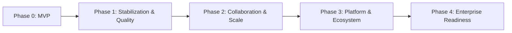

# ForgeMind — Product & Architecture Roadmap

## Table of Contents
1. Overview
2. Roadmap Principles
3. Phase 0 — MVP (Current Scope)
4. Phase 1 — Stabilization & Quality
5. Phase 2 — Collaboration & Scale
6. Phase 3 — Platform & Ecosystem
7. Phase 4 — Enterprise Readiness
8. Cross-Cutting Future Considerations (Consolidated)
9. Roadmap Diagram
10. Implementation Notes

---

## 1. Overview
This roadmap sequences the "Future Considerations" scattered across documents 01–47 into a coherent path from MVP to enterprise platform, without contradicting any decision already made in the existing documentation set.

---

## 2. Roadmap Principles
- Each phase is additive — nothing in an earlier phase is torn out to support a later one; module boundaries (`23-package-structure.md`) and abstractions (`AIProvider`, `FileStorageAdapter`) were deliberately chosen so growth doesn't require rewrites.
- A capability moves to the next phase only once its prerequisite phase is stable in production, not just "code complete."

---

## 3. Phase 0 — MVP (Current Scope)
Everything specified in documents 01–47 as the baseline: single-region deployment, modular monolith backend, ten-agent generation pipeline, Workspace IDE, GitHub integration, core security/testing/CI foundations.

**Exit criteria:** Generation pipeline reliably produces working projects; Self-Healing success rate and Review scores meet internal quality bars; security checklist (`45-security-checklist.md`) passing on every release.

---

## 4. Phase 1 — Stabilization & Quality
| Initiative | Source Document |
|---|---|
| Mutation testing on critical modules | `42-testing-strategy.md` |
| Storybook + visual regression for component catalog | `18-components.md` |
| A/B testing infrastructure for prompt variants | `27-agent-prompts.md` |
| Dynamic/learned AI provider routing | `28-ai-router.md` |
| Confidence scoring + review step for surgical-edit plans | `35-project-editing.md` |
| Dedicated `SecurityAgent` split from `ReviewAgent` | `26-agent-design.md`, `37-code-review.md` |

---

## 5. Phase 2 — Collaboration & Scale
| Initiative | Source Document |
|---|---|
| Multi-user collaboration (presence, shared cursors) in Workspace | `31-workspace.md`, `14-websocket-api.md` |
| Team accounts / `TeamSettingsPage` | `17-pages.md` |
| Extract `AIGenerationService` + Orchestrator into a separately deployed service | `11-tech-stack.md`, `21-backend-architecture.md`, `22-services.md` |
| Database partitioning for `generations` at high volume | `12-er-diagrams.md` |
| Migrate background job queue to a full message broker | `25-background-jobs.md` |
| Multi-region active-passive deployment | `41-cloud-deployment.md` |

---

## 6. Phase 3 — Platform & Ecosystem
| Initiative | Source Document |
|---|---|
| Templates marketplace full launch (beyond MVP scope) | `48-roadmap.md` cross-reference to `22-services.md` `TemplateService` |
| GitLab/Bitbucket support via generalized `GitProvider` interface | `38-github-integration.md` |
| Pluggable terminal quick-actions, detachable panels | `31-workspace.md` |
| GraphQL API alongside REST, if justified by client diversity | `11-tech-stack.md`, `15-api-versioning.md` |
| Hybrid (vector + full-text) search for RAG | `29-rag.md` |
| White-label / multi-brand theming | `19-design-system.md` |

---

## 7. Phase 4 — Enterprise Readiness
| Initiative | Source Document |
|---|---|
| SSO/OAuth login (Google, GitHub) | `24-security.md` |
| RS256/asymmetric JWT signing for multi-service token verification | `24-security.md` |
| SOC 2 readiness assessment | `45-security-checklist.md` |
| Formal third-party penetration testing | `45-security-checklist.md` |
| Kubernetes migration (if/when operational complexity justifies it) | `10-deployment-architecture.md` |
| Contract testing (Pact) for additional first-party API clients | `44-integration-tests.md` |
| Lightweight internal RFC process for architecture changes | `47-development-rules.md` |

---

## 8. Cross-Cutting Future Considerations (Consolidated)
The following recur across multiple documents and are tracked as a single workstream rather than duplicated per-phase:
- **Observability maturity** (distributed tracing, dashboards) — `41-cloud-deployment.md`.
- **Stronger code-execution isolation** (microVMs) as untrusted-generation volume grows — `39-docker.md`.
- **Semantic Java/TS language server (LSP)** for true cross-file intelligence in the editor — `33-code-editor.md`.

---

## 9. Roadmap Diagram

---

## 10. Implementation Notes
- This roadmap is reviewed alongside the quarterly documentation review (`47-development-rules.md` §5) and re-prioritized based on real production signals (Review scores, Self-Healing success rate, user growth) rather than being treated as a fixed schedule.
- No phase requires reversing a Phase 0 architectural decision — the entire 48-document set was designed so growth is additive, which is itself the primary validation that the MVP architecture was sound.
