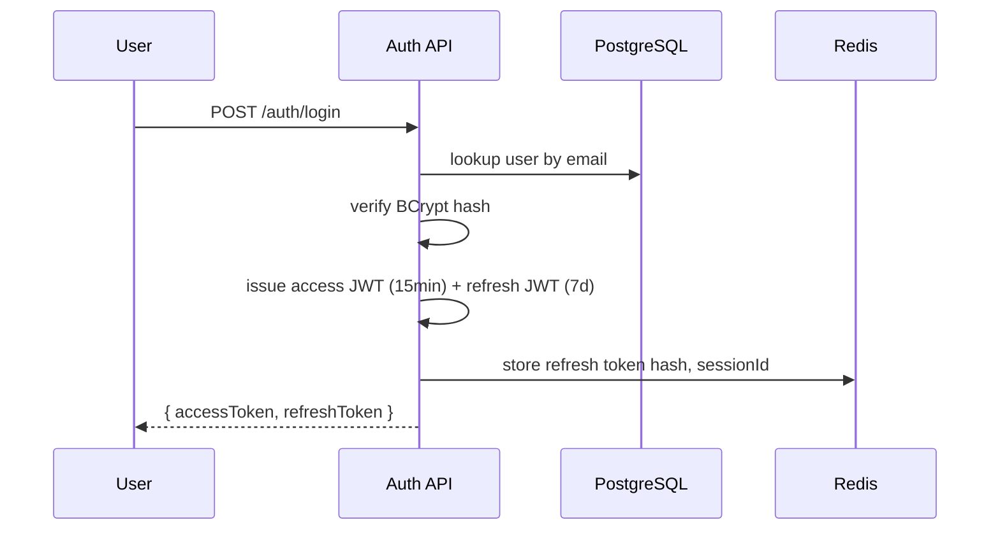

# ForgeMind — Security Architecture

## Table of Contents
1. Overview
2. Authentication
3. Authorization (RBAC)
4. JWT Design
5. Input Validation
6. Rate Limiting
7. Secrets Management
8. Audit Logs
9. Encryption
10. Threat Model Summary
11. Implementation Notes
12. Future Considerations

---

## 1. Overview
Security spans authentication, authorization, data protection, and abuse prevention. This document is the canonical reference for `45-security-checklist.md`'s audit items and underpins the Auth Module (`21-backend-architecture.md`, `22-services.md`).

---

## 2. Authentication
- Credential-based login via `POST /api/v1/auth/register` / `/login`, passwords hashed with **BCrypt** (cost factor 12), never stored or logged in plaintext.
- Stateless session via JWT access tokens (short-lived) + refresh tokens (longer-lived, stored server-side in Redis for revocability).
- Account lockout: 5 consecutive failed login attempts within 15 minutes triggers a temporary lockout (Redis counter `loginattempts:{email}`), surfaced as `429 RATE_LIMITED` per `15-api-versioning.md`.



---

## 3. Authorization (RBAC)

| Role | Permissions |
|---|---|
| `USER` | Full CRUD on own projects; read own analytics; cannot access other users' data |
| `ADMIN` | All `USER` permissions + manage templates marketplace, view platform-wide analytics, moderate flagged content |

- Enforced via Spring Security `@PreAuthorize` annotations at the Service layer (not just Controller), so authorization holds even for internal cross-module calls.
- Resource-level checks (e.g., "is this project owned by the caller?") are explicit checks inside Service methods, not solely role-based — RBAC alone is insufficient for per-resource ownership.

```java
// illustrative interface contract, not implementation
@PreAuthorize("hasRole('USER')")
ProjectResponse getProject(UUID projectId, UUID requestingUserId);
```

---

## 4. JWT Design

| Claim | Purpose |
|---|---|
| `sub` | User ID (UUID) |
| `role` | `USER` / `ADMIN` |
| `iat` / `exp` | Issued-at / expiry |
| `sid` | Session ID (correlates to Redis-stored refresh token for revocation) |

- Signing: HMAC-SHA256 with a secret rotated quarterly (`24-security.md` §7); RS256 evaluated for future multi-service signing (`48-roadmap.md`).
- Access token TTL: 15 minutes. Refresh token TTL: 7 days, single-use (rotated on every refresh — old refresh token is invalidated in Redis upon use, mitigating replay).
- Logout invalidates the Redis-stored session, making the refresh token unusable even though the JWT itself is not expired (stateless access tokens remain valid until natural expiry — kept short specifically to bound this window).

---

## 5. Input Validation
- All DTOs use Bean Validation (`@NotBlank`, `@Email`, `@Size`, custom `@StrongPassword`) at the Controller boundary (`21-backend-architecture.md`).
- File paths supplied to the Workspace Module are canonicalized and checked against the project's workspace root to prevent path traversal (`../../etc/passwd`-style attacks) — see `32-file-management.md`.
- AI prompt inputs are length-capped and stripped of control characters before being forwarded to providers; user-supplied content is never directly interpolated into system prompts without the delimiting strategy defined in `27-agent-prompts.md`.

---

## 6. Rate Limiting

| Scope | Limit | Mechanism |
|---|---|---|
| Login attempts | 5 / 15min per email | Redis counter |
| General API | 100 req/min per user | Redis token bucket, key `ratelimit:{userId}` |
| AI generation triggers | 10 / hour per user (configurable per plan) | Redis counter, enforced in `AIGenerationService` |
| WebSocket chat messages | 30 / min per project | Redis counter, enforced at `/app/chat.send` |

Exceeding a limit returns `429 RATE_LIMITED` with a `Retry-After` header (REST) or an `error` frame with `code: RATE_LIMITED` (WebSocket, `14-websocket-api.md`).

---

## 7. Secrets Management
- All secrets (DB credentials, JWT signing key, AI provider API keys, GitHub OAuth client secret) are injected via environment variables, sourced from the deployment platform's secret manager (e.g., AWS Secrets Manager, Docker secrets) — never committed to the repo or baked into images.
- JWT signing key and AI provider keys are rotated on a defined schedule (quarterly minimum); rotation procedure is documented in `45-security-checklist.md`.
- `.env.example` in the repo lists required variable names only, never real values.

---

## 8. Audit Logs

| Event | Logged Fields |
|---|---|
| Login success/failure | userId/email, IP, timestamp, outcome |
| Project create/delete | userId, projectId, timestamp |
| Generation triggered | userId, projectId, jobId, agent types involved |
| Role change (admin action) | actingAdminId, targetUserId, oldRole, newRole |
| GitHub repo connect/disconnect | userId, projectId, repoUrl |

Audit logs are append-only, written to a dedicated `audit_logs` table (extending `12-er-diagrams.md`'s model) and retained for a minimum of 1 year for compliance purposes.

---

## 9. Encryption

| Data | At Rest | In Transit |
|---|---|---|
| Database (PostgreSQL) | Disk-level encryption (managed provider default) | TLS to DB |
| Redis | Managed provider default | TLS to Redis |
| Workspace files (object storage) | Server-side encryption (SSE) | TLS |
| All client↔server traffic | N/A | TLS 1.2+ enforced at reverse proxy (`10-deployment-architecture.md`) |
| Passwords | BCrypt hash (not reversible encryption) | N/A |

---

## 10. Threat Model Summary

| Threat | Mitigation |
|---|---|
| Credential stuffing | Account lockout, rate limiting, BCrypt |
| JWT theft (XSS) | Short access-token TTL, HttpOnly storage recommendation for refresh token, CSP headers |
| Path traversal in workspace files | Path canonicalization + workspace-root containment check |
| Prompt injection via user input reaching agents | Input sanitization, delimited prompt templates (`27-agent-prompts.md`) |
| Cross-tenant data leakage | Per-resource ownership checks at the Service layer, never relying on client-supplied IDs alone |
| AI provider key leakage | Server-side-only storage, never sent to client, egress allow-list (`10-deployment-architecture.md`) |

---

## 11. Implementation Notes
- Security config centralizes in `config/SecurityConfig.java`; no controller configures its own security filter chain.
- All security-relevant changes require a second reviewer per `47-development-rules.md`.

## 12. Future Considerations
- SSO/OAuth (Google, GitHub) login as an alternative to password auth.
- Move to RS256/asymmetric JWT signing if the platform splits into multiple services that need to verify tokens without sharing a symmetric secret.
