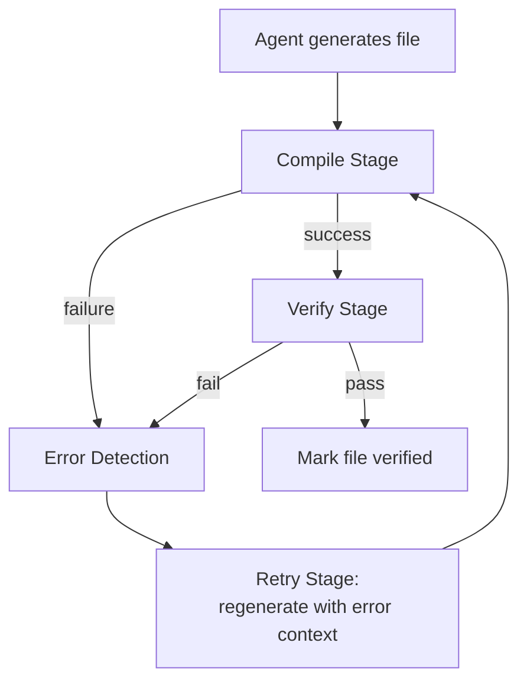
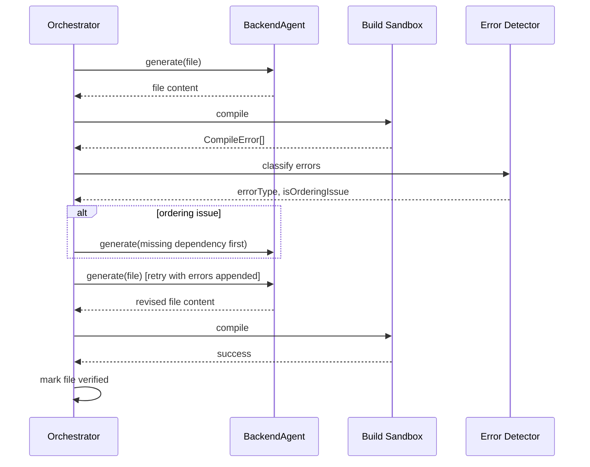

# ForgeMind — Self-Healing Pipeline

## Table of Contents
1. Overview
2. Self-Healing Loop
3. Compile Stage
4. Error Detection
5. Retry Stage
6. Regenerate Stage
7. Verify Stage
8. Loop Termination
9. Sequence Diagram
10. Implementation Notes
11. Future Considerations

---

## 1. Overview
AI-generated code does not always compile or pass basic checks on the first attempt. Self-Healing is the automated loop that catches and fixes these failures before a user ever sees broken code, referenced from `26-agent-design.md` and used by both `34-project-generation.md` (Stage 7) and `35-project-editing.md`.

---

## 2. Self-Healing Loop

---

## 3. Compile Stage
- Backend files: compiled via `mvn compile` (or a faster incremental compiler check) inside an isolated, ephemeral build sandbox scoped to the project's workspace (`39-docker.md`).
- Frontend files: type-checked via `tsc --noEmit` and linted via the project's ESLint config; a full bundler build is not run at this stage (too slow per-file), reserved for the final build trigger in `31-workspace.md`.
- Compilation runs per-file where possible, but Java's compilation unit often requires the whole module — Self-Healing batches related files (e.g., a controller + its DTOs) when isolating a single file isn't meaningful.

---

## 4. Error Detection
- Compiler/linter output is parsed into structured `CompileError { file, line, message, errorType }` records.
- Errors are classified: `SYNTAX`, `TYPE_MISMATCH`, `MISSING_IMPORT`, `MISSING_DEPENDENCY` (e.g., referencing a class from a file not yet generated), `UNRESOLVED_SYMBOL`.
- `MISSING_DEPENDENCY` errors trigger a check against `ArchitectureDesign`/`DatabaseSchema` to determine if the dependency should exist but hasn't been generated yet (ordering issue) vs. a genuine agent error.

---

## 5. Retry Stage
- The failing agent (BackendAgent/FrontendAgent) is re-invoked with the original prompt **plus** the structured compile errors appended, per the failure-behavior contract defined in each agent's prompt (`27-agent-prompts.md`).
- Retry attempts are capped (default: 3, configurable, aligned with `25-background-jobs.md`'s retry policy for AI generation steps).
- Each retry is logged with the specific error it was attempting to fix, building a traceable history useful for prompt-quality analysis (`27-agent-prompts.md` Future Considerations).

---

## 6. Regenerate Stage
If `MISSING_DEPENDENCY` analysis (§4) reveals a genuine ordering problem (e.g., BackendAgent generated a controller before its service existed), the Orchestrator reorders the generation queue and regenerates the missing dependency first, then retries the originally-failing file — rather than blindly retrying the same file in isolation.

---

## 7. Verify Stage
Beyond "does it compile," Verify runs lightweight static checks:
- Import-resolution check (no unused/missing imports).
- Naming-convention check against `46-coding-standards.md` (non-blocking — logged as a Review finding if violated, doesn't fail the loop).
- For database migrations: a dry-run against a throwaway schema to confirm the SQL is valid DDL (`13-migrations.md`).

A file only exits the loop as "verified" after passing Compile and Verify; it does not need to pass the full test suite (TestingAgent runs afterward, `26-agent-design.md` Stage 8) or full ReviewAgent scrutiny (Stage 11) — Self-Healing's bar is "valid, compiling code," not "perfect code."

---

## 8. Loop Termination

| Outcome | Result |
|---|---|
| Compiles + verifies within retry budget | File marked verified, pipeline continues |
| Exhausts retries, still failing | File flagged `CRITICAL` in the eventual Review report; pipeline continues for other files (per `34-project-generation.md` §5 partial-failure handling); the broken file is still written to the workspace (not silently dropped) so the user can see and manually fix it |

---

## 9. Sequence Diagram

---

## 10. Implementation Notes
- The build sandbox reuses the same container image defined for the generated project's own CI (`40-cicd.md`), ensuring "compiles in Self-Healing" matches "compiles in the user's eventual CI" — no environment drift between the two.
- Self-Healing is itself instrumented (`27-agent-prompts.md` Future Considerations) to track which error types most often require retries, feeding back into prompt improvements.

## 11. Future Considerations
- Static analysis beyond compilation (e.g., basic data-flow checks) as an optional, slower "deep verify" mode for critical files.
- Caching compile results for unchanged files within a single generation run to avoid redundant recompilation when only one file in a batch changes.
