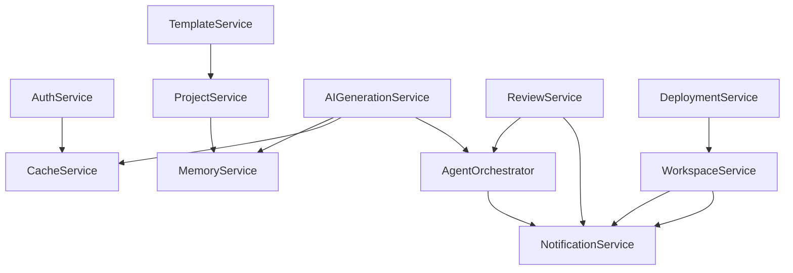

# ForgeMind — Backend Service Catalog

## Table of Contents
1. Overview
2. AuthService
3. ProjectService
4. WorkspaceService
5. MemoryService
6. AIGenerationService
7. ReviewService
8. DeploymentService
9. TemplateService
10. CacheService
11. NotificationService
12. Service Dependency Graph
13. Implementation Notes
14. Future Considerations

---

## 1. Overview
Each service below is documented with Responsibilities, Inputs, Outputs, Dependencies, and Events (published, not consumed-from-queue — see `25-background-jobs.md` for the queue-consuming side). Services live under `modules/{feature}/service/` per `21-backend-architecture.md`.

---

## 2. AuthService

| Aspect | Detail |
|---|---|
| Responsibilities | Register, authenticate, issue/refresh/revoke JWTs, password hashing (BCrypt) |
| Inputs | `RegisterRequest`, `LoginRequest`, refresh token |
| Outputs | `AuthResponse` (access + refresh token), `UserResponse` |
| Dependencies | `UserRepository`, `PasswordEncoder`, `JwtUtil`, Redis (session/refresh-token store) |
| Events Published | `UserRegisteredEvent` |

---

## 3. ProjectService

| Aspect | Detail |
|---|---|
| Responsibilities | CRUD on projects, status transitions (`DRAFT→GENERATING→READY→DEPLOYED`), version listing |
| Inputs | `CreateProjectRequest`, `UpdateProjectRequest`, `projectId` |
| Outputs | `ProjectResponse`, `List<ProjectVersionResponse>` |
| Dependencies | `ProjectRepository`, `MemoryService` (on creation, seeds initial memory) |
| Events Published | `ProjectCreatedEvent`, `ProjectStatusChangedEvent` |

---

## 4. WorkspaceService

| Aspect | Detail |
|---|---|
| Responsibilities | File tree listing, file read/write, build triggering, log streaming coordination |
| Inputs | `projectId`, `filePath`, file content, build request |
| Outputs | `FileTreeResponse`, `FileContentResponse`, `BuildResultResponse` |
| Dependencies | `FileStorageAdapter` (`32-file-management.md`), `BuildRunner` |
| Events Published | `FileChangedEvent`, `BuildStartedEvent`, `BuildCompletedEvent` |

---

## 5. MemoryService

| Aspect | Detail |
|---|---|
| Responsibilities | Persist/retrieve project memory by type/key, version increments, surgical-edit lookups |
| Inputs | `projectId`, `memoryType`, `key`, `value` (JSON) |
| Outputs | `MemorySnapshot`, `List<AffectedFile>` (for surgical edits, `08-memory.md`) |
| Dependencies | `ProjectMemoryRepository` |
| Events Published | `MemoryUpdatedEvent` |

---

## 6. AIGenerationService

| Aspect | Detail |
|---|---|
| Responsibilities | Entry point for `/ai/generate` and `/ai/chat`; delegates to Orchestrator, tracks job status |
| Inputs | `GenerationRequest`, `ChatRequest`, `jobId` (status lookups) |
| Outputs | `jobId` (async ack), `GenerationStatusResponse` |
| Dependencies | `AgentOrchestrator`, `MemoryService`, Redis (`project:status:{projectId}`) |
| Events Published | `GenerationStartedEvent`, `GenerationCompletedEvent`, `GenerationFailedEvent` |

---

## 7. ReviewService

| Aspect | Detail |
|---|---|
| Responsibilities | Trigger review pipeline (`37-code-review.md`), persist `review_reports`, expose latest report |
| Inputs | `projectId` |
| Outputs | `ReviewReportResponse` (findings, score) |
| Dependencies | `ReviewAgent` (via Orchestrator), `ReviewReportRepository` |
| Events Published | `ReviewCompletedEvent` |

---

## 8. DeploymentService

| Aspect | Detail |
|---|---|
| Responsibilities | Generate Docker/CI artifacts, track deployment status, expose deployment metadata |
| Inputs | `projectId`, target environment |
| Outputs | `DeploymentArtifactResponse` |
| Dependencies | `DeploymentAgent`, `WorkspaceService` |
| Events Published | `DeploymentArtifactGeneratedEvent` |

---

## 9. TemplateService

| Aspect | Detail |
|---|---|
| Responsibilities | Marketplace CRUD, increment download counters, instantiate a project from a template |
| Inputs | `CreateTemplateRequest`, `templateId` |
| Outputs | `TemplateResponse`, `List<TemplateResponse>` |
| Dependencies | `TemplateRepository`, `ProjectService` (instantiation) |
| Events Published | `TemplateDownloadedEvent` |

---

## 10. CacheService

| Aspect | Detail |
|---|---|
| Responsibilities | Thin wrapper over Redis for sessions, AI response cache, rate-limit counters |
| Inputs | Key, value, TTL |
| Outputs | Cached value or miss |
| Dependencies | Spring Data Redis (`RedisTemplate`) |
| Events Published | None (infrastructure-level utility) |

---

## 11. NotificationService

| Aspect | Detail |
|---|---|
| Responsibilities | Fan out in-app notifications (build complete, review ready) consumed from internal events |
| Inputs | Domain events (`BuildCompletedEvent`, `ReviewCompletedEvent`, etc.) |
| Outputs | Persisted notification rows, WebSocket push to the relevant topic |
| Dependencies | `NotificationRepository`, WebSocket `SimpMessagingTemplate` |
| Events Published | None (terminal consumer) |

---

## 12. Service Dependency Graph

---

## 13. Implementation Notes
- Every service exposes a narrow interface (`ProjectService` interface + `ProjectServiceImpl`) to support mocking in unit tests (`43-unit-tests.md`) and future extraction into separate deployables.
- Events are published via `ApplicationEventPublisher` and consumed by `@EventListener`/`@Async` handlers (e.g., `NotificationService`) — see `21-backend-architecture.md` Future Considerations.

## 14. Future Considerations
- Promote `AIGenerationService` + `AgentOrchestrator` to a separately deployed service once generation load justifies independent scaling (consistent with `11-tech-stack.md` and `48-roadmap.md`).
