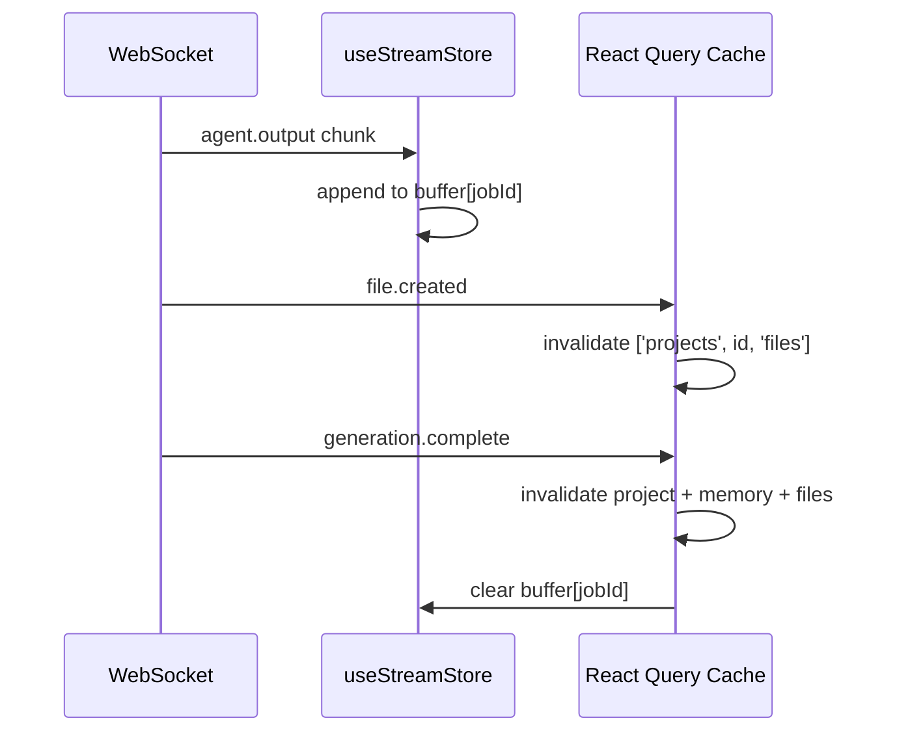

# ForgeMind — State Management

## Table of Contents
1. Overview
2. State Categories
3. React Query (Server State)
4. Context (Cross-Cutting Concerns)
5. Global State (Zustand)
6. Caching Strategy
7. Invalidation Strategy
8. Optimistic Updates
9. WebSocket-Driven State Sync
10. Implementation Notes
11. Future Considerations

---

## 1. Overview
ForgeMind splits state into three deliberately distinct mechanisms — React Query, React Context, and Zustand — each owning a different category of state, per `05-frontend.md`'s state management summary. This document gives the concrete rules for choosing between them.

---

## 2. State Categories

| Category | Examples | Owner |
|---|---|---|
| Server state | Projects, files, generations, review reports | React Query |
| Cross-cutting app state | Auth session, theme | React Context (thin providers) |
| Client/UI state | Active file, open tabs, panel layout, wizard draft | Zustand |
| Realtime/ephemeral state | Streaming agent output, live build logs | Zustand (transient slice), fed by WebSocket |

Rule of thumb: **if the backend is the source of truth, it's React Query. If it's purely client-side UI state, it's Zustand. If it must be available app-wide with minimal re-render concerns, it's Context.**

---

## 3. React Query (Server State)

### Query Key Convention
```
['projects']
['projects', projectId]
['projects', projectId, 'files']
['projects', projectId, 'file', filePath]
['projects', projectId, 'memory', memoryType]
['projects', projectId, 'versions']
['analytics', 'summary']
```

Hierarchical keys allow targeted invalidation (e.g., invalidating `['projects', projectId]` does not refetch unrelated projects).

### Default Configuration
| Setting | Value | Rationale |
|---|---|---|
| `staleTime` | 30s for list queries, 5min for rarely-changing data (memory snapshots) | Balance freshness vs. request volume |
| `retry` | 2, exponential backoff | Resilient to transient network blips |
| `refetchOnWindowFocus` | true for dashboard/list views, false for the open file in the editor (avoid clobbering unsaved edits) |

---

## 4. Context (Cross-Cutting Concerns)
Only two Context providers exist at the root (`16-ui-architecture.md`'s `RootLayout`):

| Context | Provides |
|---|---|
| `AuthContext` | Current user, JWT access token, `login()`/`logout()` |
| `ThemeContext` | Current theme, `toggleTheme()` |

Both are intentionally thin — no business logic, no frequently-changing values — to avoid the re-render fan-out Context is prone to at scale.

---

## 5. Global State (Zustand)

| Store | Scope | Key State |
|---|---|---|
| `useWizardStore` | Project creation flow | Multi-step form draft, current step |
| `useWorkspaceStore` | Per-project workspace UI | Active file, open tabs, panel sizes/collapse state |
| `useChatStore` | Per-project AI chat | Message history (mirrors WS events), draft input |
| `useStreamStore` | Per-job streaming state | In-flight `agent.output` buffers keyed by `jobId` |

Stores are scoped per `projectId` using a factory pattern (`createWorkspaceStore(projectId)`) so switching projects doesn't leak state, and are torn down on unmount.

---

## 6. Caching Strategy
- React Query's in-memory cache is the single cache layer on the client — no duplicate caching in Zustand for server data.
- Server-side, Redis caches AI responses (`ai:cache:{hash}`, `03-database.md`) for repeated identical prompts, reducing both latency and provider cost (`28-ai-router.md`).
- File content fetched into the editor is cached by React Query but always revalidated against the server's `file.created`/`file.updated` WS events to avoid stale-edit conflicts.

---

## 7. Invalidation Strategy

| Trigger | Invalidates |
|---|---|
| `POST /projects` succeeds | `['projects']` |
| `PUT /projects/{id}` succeeds | `['projects']`, `['projects', id]` |
| WS `file.created` received | `['projects', id, 'files']` |
| WS `generation.complete` received | `['projects', id]`, `['projects', id, 'memory', '*']`, `['projects', id, 'files']` |
| `POST /workspace/{id}/file` (save) succeeds | `['projects', id, 'file', filePath]` (set directly via `setQueryData`, not refetch, to avoid editor flicker) |

---

## 8. Optimistic Updates
Applied selectively where latency would otherwise hurt perceived responsiveness:

| Action | Optimistic Behavior |
|---|---|
| Rename file in File Explorer | Tree updates immediately; rolled back on `4xx`/`5xx` response |
| Send chat message | Message appears immediately with a "sending" indicator; replaced by confirmed state on WS echo |
| Toggle project favorite/star (future) | Instant UI flip, reconciled on response |

Optimistic updates are **not** used for anything AI-generation-related (file creation, code changes) — those are inherently asynchronous and always reflect real server/WS state to avoid showing code that doesn't exist yet.

---

## 9. WebSocket-Driven State Sync



A thin `useWebSocketBridge()` hook (mounted once per open project) is the only place WS events translate into Zustand updates or React Query invalidations — components never subscribe to raw WS frames directly.

---

## 10. Implementation Notes
- All Zustand stores use the `immer` middleware for ergonomic nested updates (e.g., toggling a single file tree node).
- React Query Devtools are enabled in development builds only.

## 11. Future Considerations
- Evaluate React Query's persistence plugin for offline-first dashboard viewing once that becomes a product requirement.
- Revisit Context usage if a third cross-cutting concern (e.g., feature flags) emerges — likely still a thin provider, not a reason to introduce Redux.
