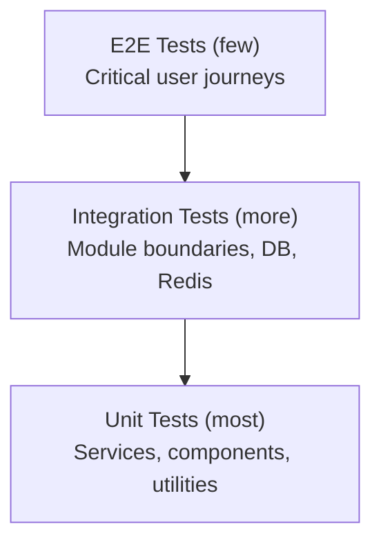

# ForgeMind — Testing Strategy

## Table of Contents
1. Overview
2. Testing Philosophy
3. Test Pyramid
4. Scope by Layer
5. AI-Specific Testing Challenges
6. Coverage Targets
7. Test Environments
8. Implementation Notes
9. Future Considerations

---

## 1. Overview
This document sets the overall testing philosophy for the ForgeMind **platform**; concrete standards live in `43-unit-tests.md` and `44-integration-tests.md`. Note: this concerns testing ForgeMind itself, distinct from TestingAgent (`26-agent-design.md`), which generates tests for *user projects*.

---

## 2. Testing Philosophy
- **Confidence over coverage theater.** A high percentage number with shallow assertions is worse than honest, lower coverage with meaningful assertions.
- **Test behavior, not implementation.** Tests should survive refactors that don't change observable behavior (e.g., refactoring `ProjectServiceImpl` internals shouldn't break its tests if the public contract is unchanged).
- **Fast feedback first.** Unit tests must run in seconds; slower integration/E2E tests are layered on top, not a substitute for fast unit coverage.
- **Non-determinism is isolated.** Anything touching AI providers is tested against mocks/fakes in the default suite; genuine end-to-end AI calls are reserved for a separate, explicitly-run suite (§5).

---

## 3. Test Pyramid

| Layer | Approx. Share | Speed |
|---|---|---|
| Unit | ~70% | Milliseconds each |
| Integration | ~25% | Seconds each (Testcontainers) |
| E2E | ~5% | Tens of seconds each |

---

## 4. Scope by Layer

| Layer | What's Tested | Tooling |
|---|---|---|
| Backend Unit | Services, validators, mappers, AI Router selection logic | JUnit 5, Mockito |
| Backend Integration | Repository queries, controller-to-DB round trips, ArchUnit dependency rules | Testcontainers (PostgreSQL, Redis), `@SpringBootTest` |
| Frontend Unit | Components, hooks, Zustand stores | Vitest, React Testing Library |
| Frontend Integration | Page-level flows with mocked API (MSW) | Vitest + MSW |
| E2E | Full user journeys (register → create project → generate → edit) | Playwright, against a real staging-like environment |

---

## 5. AI-Specific Testing Challenges

| Challenge | Approach |
|---|---|
| Non-deterministic LLM output | Unit/integration tests mock `AIProvider` responses with fixed canned outputs; never assert on exact LLM phrasing |
| Provider cost/latency in CI | All AI provider calls in the default CI suite are mocked (`28-ai-router.md`'s `AIProvider` interface makes this trivial); a separate, manually-triggered "AI smoke suite" makes real calls against a cheap model to catch prompt/schema drift |
| Self-Healing loop correctness | Tested with a fake compiler that returns scripted errors, verifying retry/regenerate logic without needing a real compile |
| Agent output schema validation | Property-based tests asserting the schema validator correctly accepts valid and rejects malformed agent outputs |

---

## 6. Coverage Targets

| Module | Minimum Line Coverage |
|---|---|
| `modules/auth`, `modules/projects` | 85% |
| `modules/ai/orchestrator`, `modules/ai/agents` | 80% (excluding live-provider integration paths, which are mocked) |
| `modules/workspace`, `modules/memory` | 80% |
| Frontend `components/`, `hooks/` | 75% |
| Frontend `pages/` | 60% (thinner logic, more covered by E2E) |

CI fails the build if coverage drops below these thresholds (`40-cicd.md`), enforced via Jacoco (backend) and Vitest coverage (frontend).

---

## 7. Test Environments

| Environment | Used For |
|---|---|
| Local | Developer-run unit + integration tests during development |
| CI (ephemeral) | Full unit + integration suite, Testcontainers spun up per run |
| Staging | E2E suite (Playwright) runs against staging after every deploy |
| AI Smoke (manual trigger) | Real-provider calls, run on a schedule (weekly) or before major prompt changes |

---

## 8. Implementation Notes
- Test doubles for `AIProvider` live in a shared `test-fixtures` module so both backend unit and integration tests reuse the same canned-response fakes, avoiding drift between test suites.
- Flaky tests are treated as bugs: a test failing intermittently is quarantined (marked `@Disabled` with a tracking ticket) within 24 hours, never left to erode trust in the suite.

## 9. Future Considerations
- Mutation testing (e.g., PIT) on critical modules (`auth`, `ai/orchestrator`) to validate that coverage numbers reflect meaningful assertions, not just executed lines.
- Visual regression testing for the frontend component catalog (`18-components.md` Future Considerations) once Storybook is introduced.
