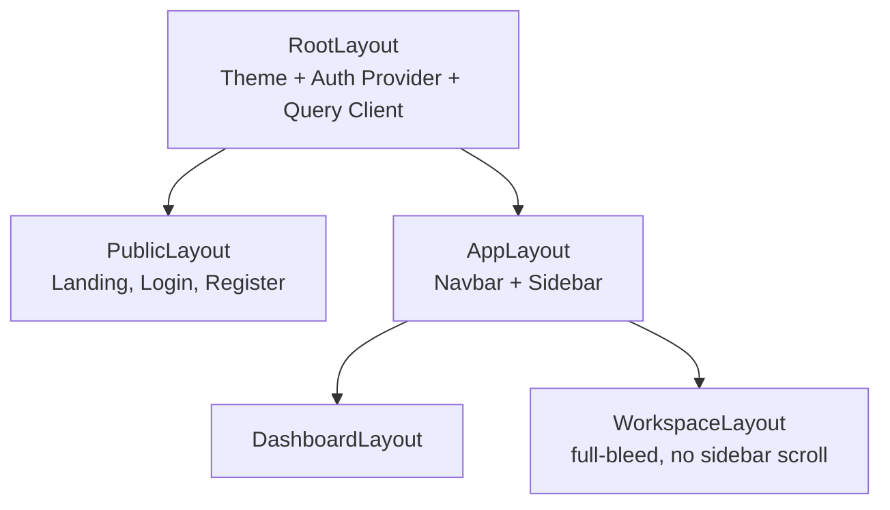
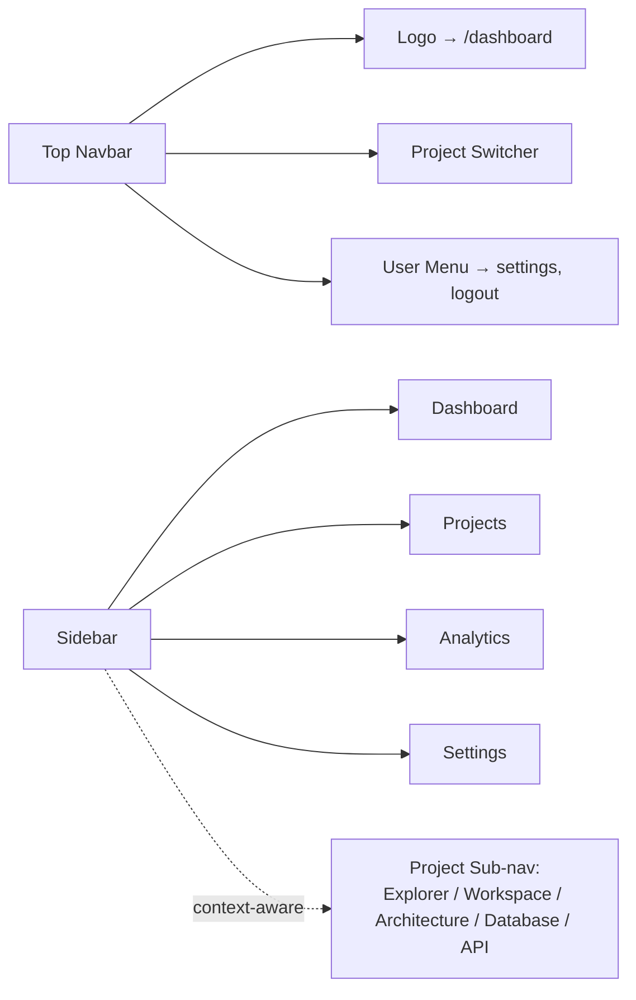

# ForgeMind — UI Architecture

## Table of Contents
1. Overview
2. Layout System
3. Navigation Model
4. Dashboard Layout
5. Workspace Layout
6. Responsive Strategy
7. Design Principles
8. Implementation Notes
9. Future Considerations

---

## 1. Overview
This document defines the structural UI architecture that `17-pages.md`, `18-components.md`, and `19-design-system.md` build upon. It extends `05-frontend.md`'s route table with concrete layout and navigation rules.

---

## 2. Layout System

ForgeMind uses a three-tier layout shell:



| Layout | Used By | Characteristics |
|---|---|---|
| `PublicLayout` | `/`, `/login`, `/register` | Centered content, marketing nav, no auth required |
| `AppLayout` | All authenticated routes | Persistent top navbar, collapsible left sidebar |
| `DashboardLayout` | `/dashboard`, `/analytics`, `/settings` | Standard scrollable content area with max-width container |
| `WorkspaceLayout` | `/projects/:id/workspace` | Full-height, full-width, fixed panels (no page scroll) |

---

## 3. Navigation Model



- The sidebar is **context-aware**: outside a project it shows global nav (Dashboard, Projects, Analytics, Settings); inside a project (`/projects/:id/*`) it switches to project sub-navigation (Explorer, Workspace, Architecture, Database, API), per the routes in `05-frontend.md`.
- Breadcrumbs render above page content for any route nested under `/projects/:id`.
- Deep-linkable state (active file, active tab) is reflected in the URL query string so links are shareable, consistent with React Router usage in `20-state-management.md`.

---

## 4. Dashboard Layout

```
┌───────────────────────────────────────────────────────────┐
│ Navbar                                                     │
├───────────┬─────────────────────────────────────────────--┤
│           │  Stats Row (Active Projects, AI Usage, etc.)   │
│ Sidebar   ├─────────────────────────────────────────────--┤
│           │  Recent Projects (Cards)                       │
│           ├─────────────────────────────────────────────--┤
│           │  Activity Timeline                             │
└───────────┴─────────────────────────────────────────────--┘
```

---

## 5. Workspace Layout

```
┌─────────────┬──────────────────────┬──────────────┐
│ File        │                      │   AI Chat    │
│ Explorer    │   Monaco Editor      │              │
│ (collapsible)│                     │   Build      │
│             │                      │   Status     │
│             ├──────────────────────│   (badges)   │
│             │   Terminal / Logs    │              │
└─────────────┴──────────────────────┴──────────────┘
```
(Matches `05-frontend.md`'s WorkspacePage layout; this document adds resize/collapse behavior below.)

- All three columns are resizable via drag handles; minimum widths enforced (File Explorer 200px, AI Chat 280px) to keep the editor usable.
- File Explorer and AI Chat panels are independently collapsible; their open/closed state persists per-project in `localStorage`-equivalent client state (Zustand, `20-state-management.md`) — **note:** persisted only in the real app, not inside any in-browser artifact preview.
- Terminal/Logs panel is a tabbed sub-panel (Terminal | Build Logs | AI Output) beneath the editor.

---

## 6. Responsive Strategy

| Breakpoint | Behavior |
|---|---|
| `< 768px` (mobile) | Workspace is **not** optimized for mobile; shows a "switch to desktop" notice. Dashboard/Explorer collapse sidebar into a drawer. |
| `768–1280px` (tablet) | Sidebar collapses to icon-only rail; Workspace panels stack with tab switching instead of 3-column layout. |
| `> 1280px` (desktop) | Full 3-column workspace, expanded sidebar by default. |

Rationale: the Monaco-based workspace is inherently a desktop-class tool (per `01-requirements.md`'s target users — developers, freelancers, teams); mobile gets a read-only/dashboard-only experience rather than a cramped editor.

---

## 7. Design Principles
1. **Context over chrome** — navigation adapts to whether the user is inside a project; avoid persistent global chrome that steals workspace real estate.
2. **Progressive disclosure** — advanced panels (Terminal, Logs, Diagrams) are collapsed by default and opened on demand.
3. **Streaming-first** — any view showing AI output assumes content arrives incrementally; layouts must not jump/reflow as content streams in (reserve space, use skeletons).
4. **Consistency with design tokens** — every layout primitive consumes spacing/color tokens from `19-design-system.md`, never hardcoded values.

---

## 8. Implementation Notes
- Layout components live in `frontend/src/components/layout/` per `06-folder-structure.md`.
- Panel resize state and collapse state are stored in Zustand slices scoped per `projectId` to avoid cross-project leakage.

## 9. Future Considerations
- A dedicated tablet-optimized workspace mode if usage data shows meaningful tablet traffic.
- Multi-monitor "detach panel" support (e.g., pop AI Chat into its own window) as a power-user feature (`48-roadmap.md`).
