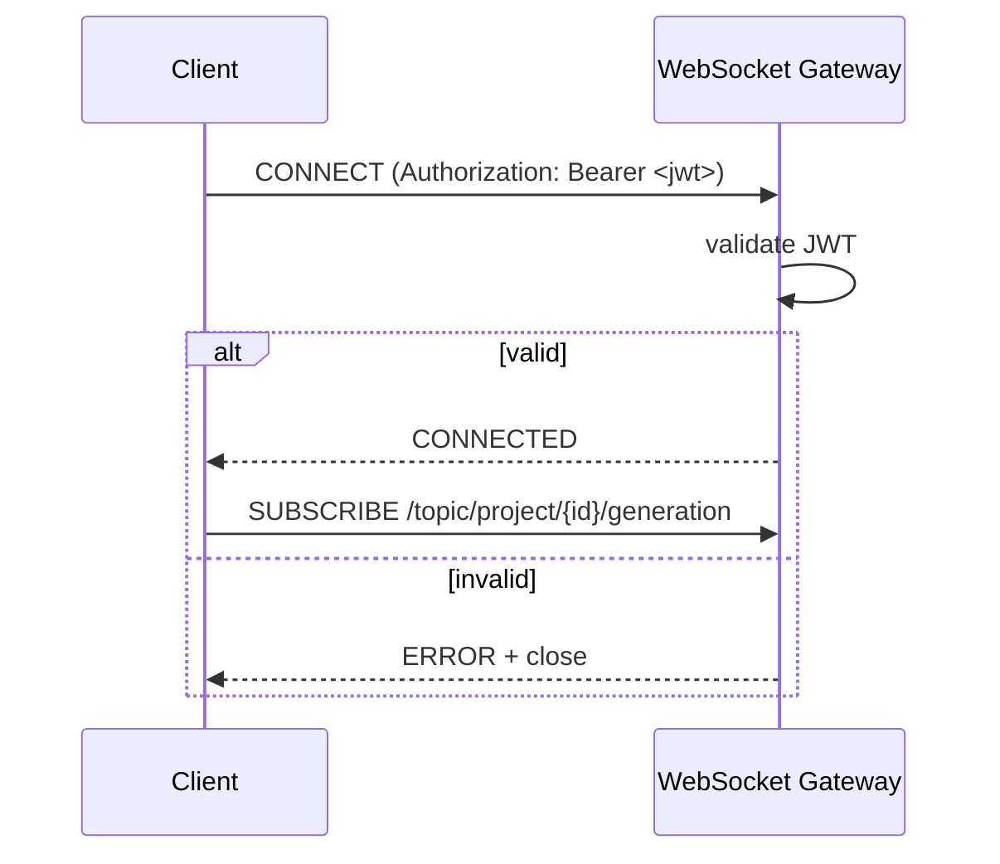
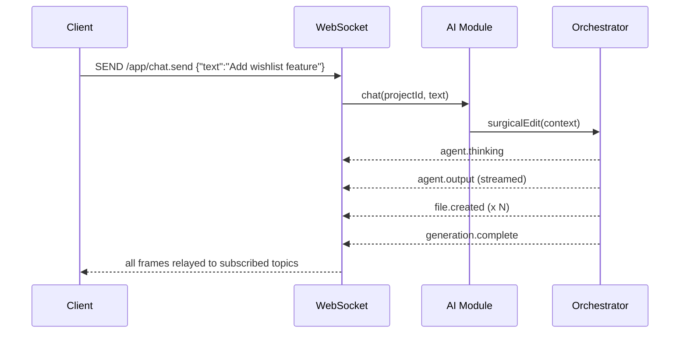

# ForgeMind — WebSocket API Design

## Table of Contents
1. Overview
2. Connection & Authentication
3. Topic / Destination Structure
4. Event Catalog & Payloads
5. Streaming AI Responses
6. Reconnection Strategy
7. Error Handling
8. Sequence Diagrams
9. Implementation Notes
10. Future Considerations

---

## 1. Overview
This document expands the WebSocket events summarized in `04-api-design.md` into full payload contracts. Transport is STOMP over WebSocket (Spring's native support), single endpoint `/ws`.

---

## 2. Connection & Authentication
- Client connects to `wss://<host>/ws` after obtaining a JWT from `/api/v1/auth/login`.
- The JWT is sent as a STOMP `CONNECT` header: `Authorization: Bearer <token>`.
- The Gateway's Auth Filter (`02-architecture.md`) validates the token on `CONNECT`; invalid/expired tokens receive a `CONNECTED` refusal with an `ERROR` frame and the socket is closed.
- Re-authentication on token refresh requires a fresh `CONNECT` (no token hot-swap on an open socket).



---

## 3. Topic / Destination Structure

| Destination Pattern | Direction | Scope |
|---|---|---|
| `/topic/project/{projectId}/generation` | Server → Client | Generation lifecycle events |
| `/topic/project/{projectId}/build` | Server → Client | Build/log streaming |
| `/topic/project/{projectId}/chat` | Bidirectional | AI chat |
| `/topic/project/{projectId}/files` | Server → Client | File create/update notifications |
| `/app/chat.send` | Client → Server | Client sends a chat message |

Authorization is enforced per-subscription: the server verifies the subscribing user owns (or has permission on) `{projectId}` before confirming the `SUBSCRIBE`, rejecting with an `ERROR` frame otherwise.

---

## 4. Event Catalog & Payloads

### generation.started
```json
{
  "event": "generation.started",
  "projectId": "uuid",
  "jobId": "uuid",
  "timestamp": "2026-06-27T10:00:00Z"
}
```

### agent.thinking
```json
{
  "event": "agent.thinking",
  "projectId": "uuid",
  "jobId": "uuid",
  "agent": "BackendAgent",
  "message": "Designing service layer for Wishlist feature"
}
```

### agent.output (streamed)
```json
{
  "event": "agent.output",
  "projectId": "uuid",
  "jobId": "uuid",
  "agent": "FrontendAgent",
  "chunk": "export function WishlistPage() {",
  "sequence": 42,
  "done": false
}
```

### file.created
```json
{
  "event": "file.created",
  "projectId": "uuid",
  "filePath": "backend/.../WishlistController.java",
  "purpose": "Handles wishlist CRUD endpoints"
}
```

### generation.complete
```json
{
  "event": "generation.complete",
  "projectId": "uuid",
  "jobId": "uuid",
  "filesChanged": 7,
  "durationMs": 48213
}
```

### build.log
```json
{
  "event": "build.log",
  "projectId": "uuid",
  "stream": "stdout",
  "line": "[INFO] BUILD SUCCESS"
}
```

### chat.message
```json
{
  "event": "chat.message",
  "projectId": "uuid",
  "sender": "user",
  "text": "Add a wishlist feature",
  "timestamp": "2026-06-27T10:01:00Z"
}
```

### error
```json
{
  "event": "error",
  "projectId": "uuid",
  "jobId": "uuid",
  "code": "AGENT_FAILURE",
  "message": "BackendAgent failed after 3 retries",
  "recoverable": true
}
```

---

## 5. Streaming AI Responses
- Agent output streams as a sequence of `agent.output` frames carrying incrementing `sequence` numbers and a final frame with `"done": true`.
- Clients buffer chunks by `(jobId, agent)` and render incrementally (e.g., into the Monaco diff view or chat panel) — see `33-code-editor.md` and `31-workspace.md`.
- Backpressure: the server batches token chunks at ~100ms intervals rather than per-token to avoid flooding slow clients; configurable via `websocket.stream.batch-interval-ms`.

---

## 6. Reconnection Strategy
- Client uses exponential backoff (1s → 2s → 4s … capped at 30s) on disconnect.
- On reconnect, client re-subscribes to the same topics and calls `GET /api/v1/ai/status/{jobId}` (REST) to fetch any state missed while disconnected — WebSocket does not replay missed events.
- The server holds no per-connection state beyond the STOMP session; all durable state lives in PostgreSQL/Redis, so reconnection is stateless from the server's perspective.

---

## 7. Error Handling

| Error Code | Cause | Client Action |
|---|---|---|
| `AUTH_FAILED` | Invalid/expired JWT on CONNECT | Refresh token, reconnect |
| `SUBSCRIBE_FORBIDDEN` | User lacks access to `projectId` | Surface permission error, do not retry |
| `AGENT_FAILURE` | Agent pipeline step failed | Show retry option; backend may auto-retry per `26-agent-design.md` |
| `RATE_LIMITED` | Too many chat/generation requests | Back off per `Retry-After`-equivalent hint in payload |
| `INTERNAL_ERROR` | Unhandled server exception | Show generic error, log `jobId` for support |

---

## 8. Sequence Diagrams

### Full Chat-Triggered Edit Flow


---

## 9. Implementation Notes
- All payloads include `projectId` so a single client subscription per project can demultiplex event types client-side if desired.
- Server-side, events are published via Spring's `SimpMessagingTemplate`; for multi-instance deployments, a Redis-backed STOMP relay is required (`10-deployment-architecture.md`).

## 10. Future Considerations
- Add a `presence` topic for multi-user collaboration on a single project (`48-roadmap.md`).
- Consider binary framing (protobuf) for `agent.output` if token-streaming volume becomes a bandwidth concern.
