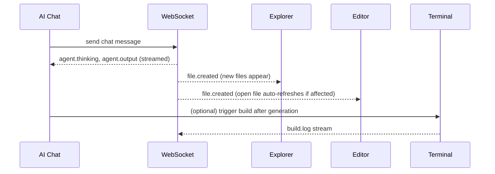

# ForgeMind — Browser IDE (Workspace)

## Table of Contents
1. Overview
2. Workspace Layout Recap
3. Explorer
4. Editor
5. Terminal
6. Logs
7. Preview
8. AI Chat
9. Cross-Panel Data Flow
10. Implementation Notes
11. Future Considerations

---

## 1. Overview
The Workspace is ForgeMind's in-browser IDE for the generated project, rendered at `/projects/:id/workspace` (`17-pages.md`). This document specifies each panel's behavior; visual layout is defined in `16-ui-architecture.md`, and component implementation detail in `18-components.md`/`33-code-editor.md`.

---

## 2. Workspace Layout Recap

```
┌─────────────┬──────────────────────┬──────────────┐
│ Explorer    │   Editor             │   AI Chat    │
│             │                      │              │
│             ├──────────────────────│   Build      │
│             │   Terminal / Logs    │   Status     │
└─────────────┴──────────────────────┴──────────────┘
```

---

## 3. Explorer
- Renders the file tree from `GET /api/v1/workspace/{id}/files` (`04-api-design.md`), backed by `WorkspaceService` (`22-services.md`) and `FileStorageAdapter` (`32-file-management.md`).
- Supports create/rename/move/delete via context menu; every mutation calls the corresponding workspace endpoint and optimistically updates the tree (`20-state-management.md`).
- Newly AI-generated files (via `file.created` WS events) animate into the tree and are auto-highlighted briefly to draw attention.
- Search-as-you-type filters the tree client-side for projects under ~2,000 files; beyond that, filtering proxies to a server-side search endpoint to avoid shipping the entire tree structure for filtering.

---

## 4. Editor
- Monaco-based (`33-code-editor.md`), one tab per open file, dirty-state indicator on unsaved changes.
- AI inline-edit: select code → floating prompt → BackendAgent/FrontendAgent processes a surgical edit scoped to the open file, rendered as a diff before acceptance.
- Read-only mode automatically applied to files currently being regenerated by an in-flight agent (tracked via `jobId` → file-path mapping) to prevent edit conflicts.

---

## 5. Terminal
- A constrained, sandboxed terminal scoped to the project's workspace directory — used for running the generated project's own build/test commands (e.g., `mvn test`, `npm run build`), not a general-purpose shell into the host system.
- Commands are executed server-side inside an isolated container/process per project (`32-file-management.md`, `39-docker.md`) and streamed back via the `build.log` WebSocket event (`14-websocket-api.md`).
- Command history persists per project per user session (client-side, not server-persisted).

---

## 6. Logs
- Tabbed alongside the Terminal: **Build Logs** (compiler/test output), **AI Output** (raw agent streaming output for debugging, collapsed by default), **Runtime Logs** (if a live preview/dev server is running).
- Logs are append-only views with auto-scroll-to-bottom (pausable when the user scrolls up to read history).

---

## 7. Preview
- For frontend-capable generated projects, a live preview pane renders the running dev server (proxied through the backend) so changes are visible without leaving the Workspace.
- Preview pane is optional/collapsible and only appears when `architecture.modules` includes a frontend module — backend-only projects show a "no preview available" state with a link to the API docs page instead.

---

## 8. AI Chat
- The primary interface for **surgical edits** (`08-memory.md`) post-initial-generation: user describes a change, RAG (`29-rag.md`) finds relevant files, the Orchestrator regenerates only what's needed.
- Streams `agent.thinking` and `agent.output` events into the chat as they occur, giving visible progress rather than a silent wait.
- Chat history is project-scoped and persists across sessions (stored via `generations`/chat persistence, not just client memory).

---

## 9. Cross-Panel Data Flow



---

## 10. Implementation Notes
- All panels subscribe to the same per-project WebSocket topics (`14-websocket-api.md`) via the single `useWebSocketBridge()` hook (`20-state-management.md`) — no panel opens its own redundant connection.
- Panel state (open/collapsed, sizes, active tab) persists per-project in client state, scoped and torn down per `20-state-management.md`'s Zustand factory pattern.

## 11. Future Considerations
- Real-time multi-user collaboration (shared cursors, presence) within a single project's Workspace.
- Pluggable terminal commands (project-specific shortcuts like "run migrations") surfaced as quick-action buttons above the Terminal panel.
